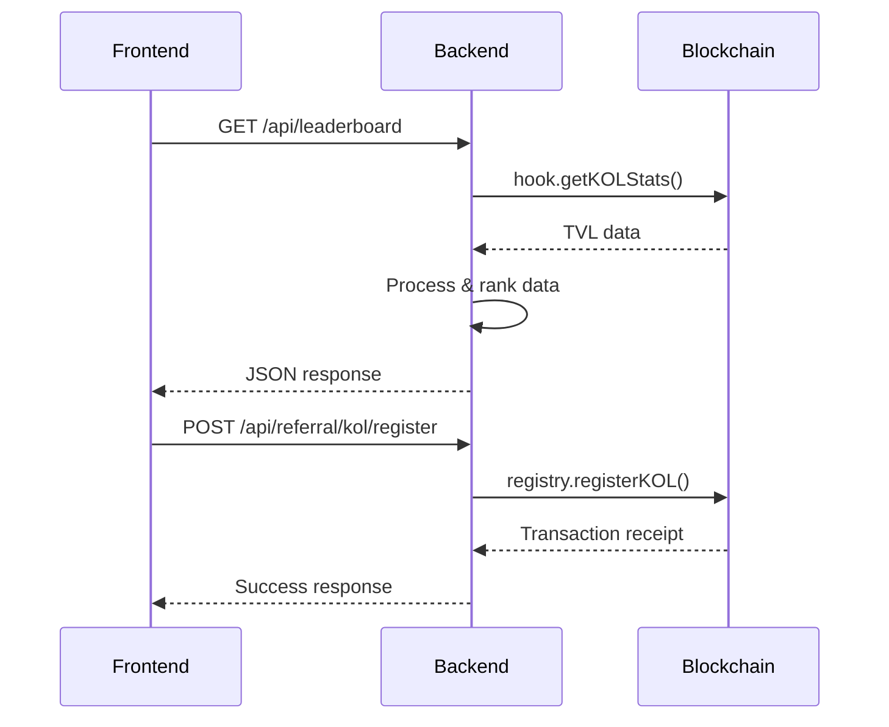

# Backend API - KOL Referral System

Backend REST API construido en Node.js que sirve como puente entre el frontend y los smart contracts en Base mainnet. Proporciona datos en tiempo real del sistema de referidos KOL.

## 🏗️ Arquitectura

```
┌─────────────────┐    ┌─────────────────┐    ┌─────────────────┐
│    Frontend     │───▶│   Backend API   │───▶│   Blockchain    │
│   (React/TS)    │    │   (Node.js)     │    │ (Base Mainnet)  │
└─────────────────┘    └─────────────────┘    └─────────────────┘
                                │
                                ├── Express.js (API REST)
                                ├── Ethers.js (Blockchain)
                                ├── Services (Business Logic)
                                └── In-Memory Cache
```

## 🚀 Características

### ✅ Implementado

- **API REST completa** con endpoints documentados
- **Integración blockchain** con ethers.js
- **Datos en tiempo real** desde smart contracts
- **Faucet integrado** para tokens de prueba
- **Sistema de salud** y monitoring
- **CORS configurado** para desarrollo
- **Logging estructurado** para debugging

### 🎯 Funcionalidades Core

- **Gestión de KOLs**: Registro y consulta
- **Sistema de referidos**: Registro de usuarios
- **Leaderboard dinámico**: Rankings automáticos
- **Pool management**: Creación y consulta
- **Liquidez**: Tracking de TVL en tiempo real

## 📡 API Endpoints

### Health & Status
```http
GET  /api/health                 # Estado general del sistema
GET  /api/faucet/health         # Estado del faucet
GET  /api/referral/health       # Estado del sistema de referidos
GET  /api/leaderboard/health    # Estado del leaderboard
GET  /api/pool/health           # Estado del sistema de pools
GET  /api/liquidity/health      # Estado del sistema de liquidez
```

### Faucet
```http
POST /api/faucet                # Obtener tokens de prueba
```
**Body:**
```json
{
  "walletAddress": "0x..."
}
```

### Referral System
```http
POST /api/referral/kol/register     # Registrar KOL
POST /api/referral/user/register    # Registrar usuario con referido
GET  /api/referral/code/:code       # Validar código de referido
GET  /api/referral/user/:address    # Obtener info de usuario
```

**Ejemplos:**
```json
// Registrar KOL
{
  "kolAddress": "0x...",
  "referralCode": "CRYPTO_GURU_2024"
}

// Registrar usuario
{
  "userAddress": "0x...",
  "referralCode": "CRYPTO_GURU_2024"
}
```

### Leaderboard
```http
GET  /api/leaderboard              # Rankings actuales
GET  /api/leaderboard/epoch        # Información del epoch actual
GET  /api/leaderboard/epoch/:id    # Rankings de epoch específico
GET  /api/leaderboard/kol/:address # Estadísticas de KOL específico
```

### Pool Management
```http
POST /api/pool/create              # Crear nuevo pool
GET  /api/pool/:poolId             # Información de pool específico
POST /api/pool/estimate-gas        # Estimar gas para creación
POST /api/pool/simulate            # Simular creación de pool
```

### Liquidity Management
```http
POST /api/liquidity/add            # Agregar liquidez
POST /api/liquidity/remove         # Remover liquidez
GET  /api/liquidity/user/:address  # Posiciones de usuario
POST /api/liquidity/estimate-gas   # Estimar gas
POST /api/liquidity/simulate       # Simular operación
```

## 🛠️ Instalación y Configuración

### Requisitos
- **Node.js**: >= 18.0.0
- **npm**: >= 8.0.0
- **Base mainnet** RPC access

### Instalación
```bash
cd kol-referral-backend
npm install
```

### Variables de Entorno
```bash
cp .env.example .env
```

```env
# Server Configuration
PORT=8080
NODE_ENV=development

# Blockchain Configuration
PRIVATE_KEY=tu_private_key_hex
RPC_URL=https://mainnet.base.org
CHAIN_ID=8453

# API Keys (Optional)
BASESCAN_API_KEY=tu_basescan_api_key
ALCHEMY_API_KEY=tu_alchemy_key

# Contract Addresses (Auto-configured)
REFERRAL_REGISTRY_ADDRESS=0x9E895E8DA3fF34C7B73D9Ad94d9E562c2D4Dc01e
TVL_LEADERBOARD_ADDRESS=0xBf133a716f07FF6a9C93e60EF3781EA491390688
REFERRAL_HOOK_ADDRESS=0x65E6c7be675a3169F90Bb074F19f616772498500
KOLTEST1_ADDRESS=0x52bc5Caf2520c31a7669A7FAaD0F8E37aF53c5D3
KOLTEST2_ADDRESS=0xFe3Ad79f52CD53bf8e948A32936d7d5EB53f00a7
```

### Ejecutar
```bash
# Desarrollo
npm run dev

# Producción
npm start

# Tests
npm test

# Linting
npm run lint
```

## 📊 Servicios Implementados

### FaucetService
```javascript
// Distribuye tokens de prueba
async function requestTokens(walletAddress) {
  // Minta 1000 KOLTEST1 y 1000 KOLTEST2
  // Rate limit: 1 request por día por wallet
}
```

### ReferralService
```javascript
// Gestiona KOLs y referidos
async function registerKOL(kolAddress, referralCode) { }
async function registerUser(userAddress, referralCode) { }
async function getKOLByUser(userAddress) { }
```

### LeaderboardService
```javascript
// Obtiene rankings en tiempo real desde blockchain
async function getCurrentLeaderboard() {
  // Llama directamente a ReferralHook.getKOLStats()
  // Ordena por TVL descendente
  // Retorna rankings actualizados
}
```

### PoolService
```javascript
// Gestiona pools de Uniswap V4
async function createPool(poolData) { }
async function getPoolInfo(poolId) { }
async function estimateGas(poolData) { }
```

### LiquidityService
```javascript
// Maneja operaciones de liquidez
async function addLiquidity(liquidityData) { }
async function removeLiquidity(liquidityData) { }
async function getUserPositions(userAddress) { }
```

## 🔄 Flujo de Datos



## 🔐 Seguridad

### Controles Implementados
- **Input validation** con Joi schemas
- **Rate limiting** en endpoints críticos
- **CORS** configurado apropiadamente
- **Error handling** sin exposición de datos sensibles
- **Private key** encriptada en variables de entorno

### Logging
```javascript
// Structured logging con diferentes niveles
logger.info('KOL registered', { kolAddress, referralCode });
logger.error('Blockchain error', { error: error.message, stack });
logger.warn('Rate limit exceeded', { ip, endpoint });
```

## 🔮 Roadmap Futuro

### Phase 2: Enhanced Analytics
- **Real-time dashboards** con WebSockets
- **Historical data** storage con base de datos
- **Advanced metrics** (retention, growth rates)
- **Export functionality** para KOLs

### Phase 3: Oracle Integration
```javascript
// Planned services
class PriceOracleService {
  async getUSDPrice(tokenAddress) { }
  async calculateTVLInUSD(kolAddress) { }
  async getHistoricalPrices(tokenAddress, timeRange) { }
}
```

### Phase 4: Rewards & Notifications
```javascript
// Planned features
class RewardsService {
  async calculateRewards(kolAddress, epochId) { }
  async distributeRewards(epochId) { }
  async getClaimableRewards(kolAddress) { }
}

class NotificationService {
  async sendNewReferralNotification(kolAddress) { }
  async sendRewardsAvailableNotification(kolAddress) { }
}
```

### Phase 5: Advanced Features
- **GraphQL API** para queries complejas
- **Caching layer** con Redis
- **Database integration** para persistencia
- **Microservices architecture** para escalabilidad

## 🧪 Testing

### Tests Unitarios
```bash
npm test                    # Todos los tests
npm test -- --grep "FaucetService"  # Tests específicos
npm run test:coverage       # Coverage report
```

### Tests de Integración
```bash
npm run test:integration    # Tests con blockchain
npm run test:e2e           # End-to-end tests
```

### Estructura de Tests
```
test/
├── unit/
│   ├── services/
│   ├── controllers/
│   └── middleware/
├── integration/
│   ├── blockchain/
│   └── api/
└── fixtures/
    └── mockData.js
```

## 📈 Monitoring y Observabilidad

### Métricas Tracked
- **Request latency** por endpoint
- **Error rates** por servicio
- **Blockchain call success rate**
- **Memory y CPU usage**
- **Active connections**

### Health Checks
```javascript
// Ejemplo de health check
{
  "status": "healthy",
  "timestamp": "2024-01-15T10:30:00Z",
  "version": "1.0.0",
  "services": {
    "blockchain": "connected",
    "contracts": "verified",
    "cache": "operational"
  }
}
```

## 🤝 Contribución

1. **Fork** el repositorio
2. **Crear** feature branch: `git checkout -b feature/new-endpoint`
3. **Escribir tests** para nueva funcionalidad
4. **Ejecutar** tests: `npm test`
5. **Verificar** linting: `npm run lint`
6. **Commit** cambios: `git commit -m 'Add new endpoint'`
7. **Push** branch: `git push origin feature/new-endpoint`
8. **Crear** Pull Request

### Estándares de Código
- **ESLint** configurado con reglas estrictas
- **Prettier** para formatting consistente
- **Conventional commits** para mensajes
- **JSDoc** para documentación de funciones

---

**Nota**: Para producción, se recomienda implementar autenticación, base de datos persistente, y monitoring avanzado. 