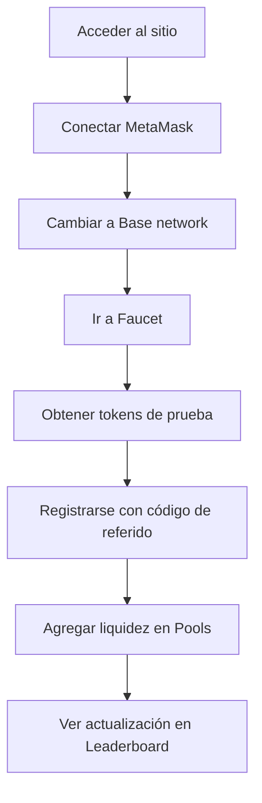
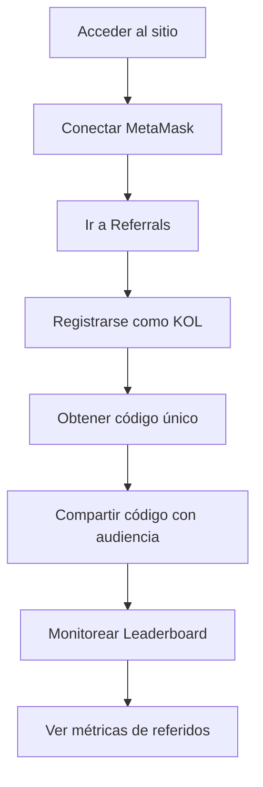

# Frontend - KOL Referral System

Aplicación web moderna construida en React y TypeScript que proporciona una interfaz intuitiva para el sistema de referidos KOL. Permite a usuarios interactuar con Uniswap V4 y gestionar referidos de manera sencilla.

## 🏗️ Arquitectura Frontend

```
┌─────────────────────────────────────────────────────────────┐
│                    KOL Referral Frontend                    │
├─────────────────────────────────────────────────────────────┤
│  React + TypeScript + Vite + TailwindCSS + MetaMask       │
├─────────────────────────────────────────────────────────────┤
│  Components  │  Hooks  │  Services  │  Utils  │  Types     │
├─────────────────────────────────────────────────────────────┤
│           useWeb3 │ useLiquidity │ useReferral            │
├─────────────────────────────────────────────────────────────┤
│                    Backend API                              │
├─────────────────────────────────────────────────────────────┤
│                 Base Mainnet (Blockchain)                  │
└─────────────────────────────────────────────────────────────┘
```

## 🚀 Características

### ✅ Implementado

- **Interfaz moderna** con TailwindCSS y componentes reutilizables
- **Integración MetaMask** completa con detección automática
- **Gestión de estado** con React hooks personalizados
- **Transacciones blockchain** directas desde el frontend
- **Actualización en tiempo real** de datos del leaderboard
- **Faucet integrado** para obtener tokens de prueba
- **Responsive design** compatible con móviles

### 🎯 Funcionalidades Core

- **Dashboard principal** con métricas del sistema
- **Registro de KOLs** con códigos únicos
- **Registro de usuarios** con referidos
- **Leaderboard dinámico** con rankings
- **Gestión de pools** y liquidez
- **Wallet integration** con MetaMask

## 🖥️ Páginas y Componentes

### Dashboard (`/`)
```typescript
// Página principal con overview del sistema
- Métricas generales (Total KOLs, TVL, etc.)
- Acceso rápido a funcionalidades principales
- Estado de conexión blockchain en tiempo real
```

### Referrals (`/referrals`)
```typescript
// Gestión completa del sistema de referidos
- Registro de KOLs con códigos únicos
- Registro de usuarios con códigos de referidos
- Validación en tiempo real de códigos
- Historial de referidos por KOL
```

### Leaderboard (`/leaderboard`)
```typescript
// Rankings dinámicos de KOLs
- Tabla de rankings por TVL
- Información de epochs actuales
- Métricas detalladas por KOL
- Actualización automática cada 30s
```

### Pools (`/pools`)
```typescript
// Gestión de pools de Uniswap V4
- Creación de nuevos pools
- Consulta de pools existentes
- Agregar/remover liquidez
- Estimación de gas en tiempo real
```

### Faucet (`/faucet`)
```typescript
// Obtención de tokens de prueba
- Distribución automática de KOLTEST1 y KOLTEST2
- Rate limiting visual
- Verificación de balances automática
- Transacciones con feedback visual
```

## 🛠️ Instalación y Configuración

### Requisitos
- **Node.js**: >= 18.0.0
- **npm**: >= 8.0.0
- **MetaMask**: Extensión del navegador
- **Base network**: Configurado en MetaMask

### Instalación
```bash
cd kol-referral-frontend
npm install
```

### Variables de Entorno
```bash
cp .env.example .env
```

```env
# Backend API URL
VITE_API_URL=http://localhost:8080

# Network Configuration (auto-detected)
VITE_CHAIN_ID=8453
VITE_NETWORK_NAME=Base

# Optional: Analytics/Monitoring
VITE_ANALYTICS_ID=your_analytics_id
```

### Ejecutar
```bash
# Desarrollo
npm run dev

# Build para producción
npm run build

# Preview del build
npm run preview

# Linting
npm run lint

# Type checking
npm run type-check
```

## 🔧 Hooks Personalizados

### useWeb3
```typescript
// Gestión completa de wallet y blockchain
const { 
  address,           // Dirección del usuario conectado
  isConnected,       // Estado de conexión
  connectWallet,     // Función para conectar
  getProvider,       // Provider de ethers.js
  chainId,          // Chain ID actual
  switchToBase      // Cambiar a Base network
} = useWeb3();
```

### useLiquidity
```typescript
// Operaciones de liquidez en Uniswap V4
const {
  addLiquidity,      // Agregar liquidez con Permit2
  getTokenBalance,   // Consultar balances
  isLoading         // Estado de carga
} = useLiquidity();
```

### useReferral
```typescript
// Sistema de referidos
const {
  registerKOL,       // Registrar como KOL
  registerUser,      // Registrar con código de referido
  validateCode,      // Validar código de referido
  isLoading         // Estado de carga
} = useReferral();
```

### useLeaderboard
```typescript
// Datos del leaderboard
const {
  leaderboard,       // Rankings actuales
  currentEpoch,      // Información del epoch
  refreshData,       // Actualizar manualmente
  isLoading         // Estado de carga
} = useLeaderboard();
```

## 📱 Componentes UI

### Layout Components
```typescript
// Layout principal
<Layout>
  <Header />         // Navigation y wallet connection
  <Sidebar />        // Menu lateral con links
  <Main />          // Contenido principal
  <Footer />        // Footer con links útiles
</Layout>
```

### Feature Components
```typescript
// Componentes específicos de funcionalidad
<WalletConnect />   // Botón de conexión MetaMask
<LeaderboardTable />// Tabla de rankings
<LiquidityForm />   // Formulario para agregar liquidez
<ReferralForm />    // Formulario de registro
<PoolCreator />     // Creador de pools
<TokenBalance />    // Display de balances
```

### UI Components
```typescript
// Componentes base reutilizables
<Button />          // Botones con variants
<Input />           // Inputs con validación
<Card />            // Contenedores con styling
<Modal />           // Modales con overlay
<Toast />           // Notificaciones temporales
<Spinner />         // Loading indicators
```

## 🎨 Sistema de Diseño

### Colores (TailwindCSS)
```css
/* Paleta principal */
primary: blue-600    /* Links y CTAs principales */
secondary: gray-600  /* Texto secundario */
success: green-500   /* Estados exitosos */
warning: yellow-500  /* Advertencias */
error: red-500      /* Errores */
```

### Typography
```css
/* Jerarquía de texto */
heading-1: text-3xl font-bold    /* Títulos principales */
heading-2: text-xl font-semibold /* Subtítulos */
body: text-base                  /* Texto normal */
caption: text-sm text-gray-500   /* Texto pequeño */
```

### Responsive Breakpoints
```css
/* Mobile first approach */
sm: 640px   /* Tablet pequeña */
md: 768px   /* Tablet */
lg: 1024px  /* Desktop */
xl: 1280px  /* Desktop grande */
```

## 🔄 Flujo de Usuario

### Nuevo Usuario


### KOL (Influencer)


## 🚀 Funcionalidades por Página

### Dashboard
- **Métricas generales**: Total TVL, KOLs activos, usuarios registrados
- **Acceso rápido**: Links a funcionalidades principales
- **Estado del sistema**: Health checks de contratos
- **Últimas actividades**: Feed de transacciones recientes

### Referrals
- **Registro KOL**: Formulario con validación de código único
- **Registro Usuario**: Input de código de referido con validación
- **Búsqueda**: Buscar KOLs por código o dirección
- **Estadísticas**: Métricas de referidos por KOL

### Leaderboard
- **Tabla de rankings**: Ordenada por TVL descendente
- **Información de epochs**: Duración y estado actual
- **Filtros**: Por época, por KOL específico
- **Exportar**: Descargar datos en CSV (futuro)

### Pools
- **Crear pool**: Formulario completo con estimación de gas
- **Buscar pools**: Por Pool ID o tokens
- **Agregar liquidez**: Interfaz intuitiva con balance checking
- **Historial**: Transacciones del usuario

### Faucet
- **Obtener tokens**: Un click para recibir tokens de prueba
- **Rate limiting**: Indicador visual de tiempo restante
- **Balances**: Display en tiempo real de tokens
- **Historial**: Últimas distribuciones del faucet

## 🔮 Roadmap Futuro

### Phase 2: Enhanced UX
- **Dark mode** toggle
- **Multi-language** support (ES/EN)
- **Advanced charts** con Chart.js
- **Real-time notifications** con WebSockets
- **Mobile app** con React Native

### Phase 3: Advanced Features
```typescript
// Planned components
<AnalyticsDashboard />  // Métricas avanzadas
<RewardsCenter />       // Centro de rewards
<StakingInterface />    // Interface de staking
<GovernancePanel />     // Voting y proposals
<ReferralTree />        // Visualización de árbol de referidos
```

### Phase 4: Gamification
- **Achievement system** con badges
- **Progress bars** para goals
- **Leaderboard animations** y effects
- **Social sharing** de logros
- **Competition modes** entre KOLs

## 🧪 Testing

### Unit Tests
```bash
npm run test              # Tests con Vitest
npm run test:coverage     # Coverage report
npm run test:watch        # Watch mode
```

### E2E Tests
```bash
npm run test:e2e          # Playwright tests
npm run test:e2e:ui       # UI mode
```

### Estructura de Tests
```
src/
├── __tests__/
│   ├── components/
│   ├── hooks/
│   ├── services/
│   └── utils/
├── e2e/
│   ├── user-flows/
│   ├── wallet-integration/
│   └── blockchain-interactions/
└── test-utils/
    └── setup.ts
```

## 🔐 Seguridad Frontend

### Controles Implementados
- **Input sanitization** para prevenir XSS
- **Wallet address validation** con checksum
- **Transaction verification** antes de envío
- **Error boundaries** para capturar crashes
- **Rate limiting** en UI para APIs

### Best Practices
```typescript
// Validación de transacciones
const validateTransaction = (tx: Transaction) => {
  if (!ethers.isAddress(tx.to)) throw new Error('Invalid address');
  if (tx.value < 0) throw new Error('Invalid amount');
  // ... más validaciones
};

// Manejo seguro de private keys (nunca en frontend)
// Solo uso de MetaMask provider
const signer = await provider.getSigner();
```

## 📈 Performance

### Optimizaciones Implementadas
- **Code splitting** por rutas
- **Lazy loading** de componentes pesados
- **Memoization** con React.memo y useMemo
- **Bundle optimization** con Vite
- **Image optimization** con WebP

### Métricas Target
- **First Contentful Paint**: < 2s
- **Time to Interactive**: < 3s
- **Bundle size**: < 500KB gzipped
- **Lighthouse score**: > 90

## 🤝 Contribución

1. **Fork** el repositorio
2. **Crear** feature branch: `git checkout -b feature/new-component`
3. **Seguir** style guide de componentes
4. **Escribir** tests para nuevos componentes
5. **Ejecutar** linting: `npm run lint`
6. **Verificar** tipos: `npm run type-check`
7. **Commit** cambios: `git commit -m 'Add new component'`
8. **Push** branch: `git push origin feature/new-component`
9. **Crear** Pull Request

### Estándares de Código
- **ESLint + Prettier** configurados
- **TypeScript strict mode** habilitado
- **Component naming**: PascalCase
- **Hook naming**: use + CamelCase
- **File naming**: kebab-case

---

**Nota**: Para producción, se recomienda implementar analytics, error tracking (Sentry), y monitoring de performance. 