# Frontend - KOL Referral System

Modern React frontend with TypeScript for the KOL referral system. Provides an intuitive interface for KOL management, liquidity operations, and real-time leaderboard tracking.

## 🚀 Features

### ✅ Implemented
- **🔗 MetaMask Integration** - Wallet connection and transaction signing
- **👤 KOL Registration** - Simple registration flow with unique codes
- **👥 User Referral System** - User registration with referral codes
- **💧 Liquidity Management** - Add/remove liquidity with real-time feedback
- **🏆 Dynamic Leaderboard** - Live rankings with TVL tracking
- **🚰 Integrated Faucet** - Get test tokens with one click
- **📊 Real-time Data** - Live updates from Base mainnet
- **🎨 Modern UI/UX** - Clean, responsive design with Tailwind CSS

### 🎯 Key Components
- **Wallet Connection** with automatic network switching to Base
- **Pool Creation & Management** with gas estimation
- **Token Balance Tracking** with automatic updates
- **Transaction Status Monitoring** with loading states
- **Error Handling** with user-friendly messages

## 🏗️ Architecture

```
src/
├── components/
│   ├── common/               # Reusable UI components
│   ├── wallet/              # Wallet connection
│   ├── referral/            # KOL/User registration
│   ├── pools/               # Pool management
│   ├── liquidity/           # Liquidity operations
│   ├── leaderboard/         # Rankings display
│   └── faucet/              # Token distribution
├── hooks/
│   ├── useWallet.ts         # Wallet state management
│   ├── useContract.ts       # Contract interactions
│   ├── useLiquidity.ts      # Liquidity operations
│   └── useLeaderboard.ts    # Real-time rankings
├── types/
│   └── contracts.ts         # TypeScript contract types
├── utils/
│   ├── constants.ts         # Contract addresses
│   ├── permits.ts           # Permit2 integration
│   └── formatting.ts        # Data formatting
└── services/
    └── api.ts               # Backend API calls
```

## 🔧 Installation and Setup

### Prerequisites
- **Node.js**: >= 18.0.0
- **npm**: >= 8.0.0
- **MetaMask**: Browser extension installed

### 1. Install Dependencies
```bash
cd kol-referral-frontend
npm install
```

### 2. Environment Configuration
```bash
cp .env.example .env
```

```env
# API Configuration
VITE_API_URL=http://localhost:8080

# Blockchain Configuration (Base Mainnet)
VITE_CHAIN_ID=8453
VITE_RPC_URL=https://mainnet.base.org

# Contract Addresses
VITE_REFERRAL_REGISTRY=0x9E895E8DA3fF34C7B73D9Ad94d9E562c2D4Dc01e
VITE_TVL_LEADERBOARD=0xBf133a716f07FF6a9C93e60EF3781EA491390688
VITE_REFERRAL_HOOK=0x65E6c7be675a3169F90Bb074F19f616772498500
VITE_KOLTEST1=0x52bc5Caf2520c31a7669A7FAaD0F8E37aF53c5D3
VITE_KOLTEST2=0xFe3Ad79f52CD53bf8e948A32936d7d5EB53f00a7

# Uniswap V4 (Base)
VITE_POOL_MANAGER=0x498581fF718922c3f8e6A244956aF099B2652b2b
VITE_POSITION_MANAGER=0x7C5f5A4bBd8fD63184577525326123B519429bDc
VITE_PERMIT2=0x000000000022D473030F116dDEE9F6B43aC78BA3
```

### 3. Start Development Server
```bash
# Development mode
npm run dev

# Build for production
npm run build

# Preview production build
npm run preview
```

The application will start at `http://localhost:3000`

## 🎮 User Guide

### 1. Wallet Connection
1. **Install MetaMask** if not already installed
2. **Click "Connect Wallet"** in the app
3. **Select MetaMask** from the options
4. **Approve connection** in MetaMask
5. **Switch to Base network** when prompted

### 2. Get Test Tokens
1. **Go to "Faucet" section**
2. **Ensure wallet is connected**
3. **Click "Get Test Tokens"**
4. **Confirm transaction** in MetaMask
5. **Wait for confirmation** (5-10 seconds)

### 3. Register as KOL
1. **Navigate to "Referral" section**
2. **Enter your unique referral code** (3-20 characters, A-Z, 0-9)
3. **Click "Register as KOL"**
4. **Confirm transaction** in MetaMask
5. **Your referral code is now active**

### 4. Register User with Referral
1. **Navigate to "Referral" section**
2. **Switch to "User Registration" tab**
3. **Enter KOL's referral code**
4. **Click "Register with Referral"**
5. **Confirm transaction** in MetaMask

### 5. Add Liquidity
1. **Go to "Pools" → "Add Liquidity"**
2. **Enter amounts** for KOLTEST1 and KOLTEST2
3. **Click "Add Liquidity"**
4. **Approve tokens** if first time (2 transactions)
5. **Confirm liquidity addition**
6. **See automatic leaderboard update**

## 💻 Component Documentation

### Core Hooks

#### `useWallet`
```typescript
const {
  account,           // Connected wallet address
  isConnected,       // Connection status
  connect,           // Connect wallet function
  disconnect,        // Disconnect function
  switchToBase       // Switch to Base network
} = useWallet();
```

#### `useLiquidity`
```typescript
const {
  addLiquidity,      // Add liquidity function
  balances,          // Token balances
  isLoading,         // Loading state
  error              // Error state
} = useLiquidity();
```

#### `useLeaderboard`
```typescript
const {
  leaderboard,       // KOL rankings
  isLoading,         // Loading state
  refresh            // Manual refresh function
} = useLeaderboard();
```

### Key Components

#### `WalletConnect`
```tsx
// Handles wallet connection and network switching
<WalletConnect 
  onConnect={(address) => console.log('Connected:', address)}
  requiredChainId={8453}
/>
```

#### `TokenBalance`
```tsx
// Displays token balance with real-time updates
<TokenBalance 
  tokenAddress="0x..."
  userAddress="0x..."
  symbol="KOLTEST1"
/>
```

#### `LiquidityForm`
```tsx
// Complete liquidity addition interface
<LiquidityForm 
  onSuccess={(txHash) => console.log('Success:', txHash)}
  onError={(error) => console.error('Error:', error)}
/>
```

#### `Leaderboard`
```tsx
// Real-time KOL rankings display
<Leaderboard 
  limit={10}
  autoRefresh={true}
  refreshInterval={30000}
/>
```

## 🔄 Data Flow

### 1. Wallet Connection Flow
```
User clicks Connect → MetaMask opens → User approves → 
Check network → Switch to Base if needed → 
Update UI state → Load balances
```

### 2. Liquidity Addition Flow
```
User enters amounts → Check allowances → 
Request approvals if needed → User approves → 
Prepare transaction → User signs → 
Submit to Position Manager → Update balances → 
Refresh leaderboard
```

### 3. Real-time Updates
```
Component mounts → Start polling → 
API call to backend → Backend queries contracts → 
Update UI state → Schedule next poll
```

## 🎨 UI/UX Features

### Responsive Design
- **Mobile-first** approach with Tailwind CSS
- **Tablet optimization** for better usability
- **Desktop enhancement** with advanced layouts

### Loading States
```tsx
// Example loading component
{isLoading ? (
  <div className="animate-spin rounded-full h-8 w-8 border-b-2 border-blue-500" />
) : (
  <ComponentContent />
)}
```

### Error Handling
```tsx
// User-friendly error display
{error && (
  <div className="bg-red-100 border border-red-400 text-red-700 px-4 py-3 rounded">
    {error.message}
  </div>
)}
```

### Transaction Feedback
- **Progress indicators** during transactions
- **Success animations** on completion
- **Clear error messages** with retry options
- **Gas estimation** before transactions

## 🔐 Security Features

### Contract Interactions
```typescript
// Example secure contract call
const addLiquidity = async (amount0: string, amount1: string) => {
  try {
    // Validate inputs
    if (!isValidAmount(amount0) || !isValidAmount(amount1)) {
      throw new Error('Invalid amounts');
    }
    
    // Check allowances
    await checkAndRequestApprovals(amount0, amount1);
    
    // Prepare transaction
    const tx = await positionManager.modifyLiquidities(/* ... */);
    
    // Wait for confirmation
    const receipt = await tx.wait();
    
    return receipt;
  } catch (error) {
    // Handle errors appropriately
    handleTransactionError(error);
  }
};
```

### Input Validation
- **Address format** validation with ethers.js
- **Amount validation** with decimal handling
- **Referral code** format checking
- **Network verification** before transactions

## 🧪 Testing

### Unit Tests
```bash
# Run all tests
npm test

# Run with coverage
npm run test:coverage

# Run specific component tests
npm test -- TokenBalance.test.tsx
```

### E2E Testing
```bash
# Install Playwright
npm install @playwright/test

# Run E2E tests
npm run test:e2e

# Run specific E2E test
npm run test:e2e -- liquidity.spec.ts
```

### Testing Structure
```
src/
├── __tests__/
│   ├── components/
│   ├── hooks/
│   └── utils/
└── e2e/
    ├── wallet-connection.spec.ts
    ├── kol-registration.spec.ts
    ├── liquidity-addition.spec.ts
    └── leaderboard.spec.ts
```

## 🔮 Future Features (Roadmap)

### Phase 2: Enhanced UX
- **Dark mode** toggle
- **Multi-language** support (i18n)
- **Advanced animations** with Framer Motion
- **Push notifications** for important events

### Phase 3: Advanced Features
- **Historical charts** with Chart.js
- **Advanced filtering** and search
- **Export functionality** for KOL data
- **Mobile app** with React Native

### Phase 4: Social Features
- **KOL profiles** with social links
- **Achievement system** with badges
- **Referral tree** visualization
- **Community features** and messaging

## 📊 Performance Optimization

### Current Optimizations
- **Code splitting** with React.lazy()
- **Memoization** with useMemo and useCallback
- **Virtual scrolling** for large lists
- **Image optimization** with lazy loading

### Bundle Analysis
```bash
# Analyze bundle size
npm run analyze

# Check for unused dependencies
npm run depcheck
```

### Performance Metrics
- **First Contentful Paint**: < 1.5s
- **Time to Interactive**: < 3s
- **Bundle size**: < 500KB (gzipped)
- **Lighthouse score**: > 90

## 🔧 Development Tools

### Recommended VS Code Extensions
- **ES7+ React/Redux/React-Native snippets**
- **TypeScript Importer**
- **Tailwind CSS IntelliSense**
- **Auto Rename Tag**

### Development Scripts
```bash
npm run dev          # Start development server
npm run build        # Build for production
npm run lint         # Run ESLint
npm run lint:fix     # Fix ESLint issues
npm run type-check   # Run TypeScript checks
npm run format       # Format with Prettier
```

## 🤝 Contributing

### Code Standards
- **TypeScript** for type safety
- **ESLint + Prettier** for code consistency
- **Conventional commits** for commit messages
- **Component documentation** with JSDoc

### Development Workflow
```bash
# Create feature branch
git checkout -b feature/new-component

# Make changes
# Write tests
npm test

# Lint and format
npm run lint:fix
npm run format

# Commit changes
git commit -m "feat: add new component for X"

# Push and create PR
git push origin feature/new-component
```

### Pull Request Guidelines
1. **Include tests** for new components
2. **Update documentation** if needed
3. **Test on multiple browsers**
4. **Include screenshots** for UI changes

## 📝 License

MIT License - see LICENSE file for details.

---

### useWeb3
```typescript
// Gestión completa de wallet y blockchain
const { 
  address,           // Dirección del usuario conectado
  isConnected,       // Estado de conexión
  connectWallet,     // Función para conectar
  getProvider,       // Provider de ethers.js
  chainId,          // Chain ID actual
  switchToBase      // Cambiar a Base network
} = useWeb3();
```

### useLiquidity
```typescript
// Operaciones de liquidez en Uniswap V4
const {
  addLiquidity,      // Agregar liquidez con Permit2
  getTokenBalance,   // Consultar balances
  isLoading         // Estado de carga
} = useLiquidity();
```

### useReferral
```typescript
// Sistema de referidos
const {
  registerKOL,       // Registrar como KOL
  registerUser,      // Registrar con código de referido
  validateCode,      // Validar código de referido
  isLoading         // Estado de carga
} = useReferral();
```

### useLeaderboard
```typescript
// Datos del leaderboard
const {
  leaderboard,       // Rankings actuales
  currentEpoch,      // Información del epoch
  refreshData,       // Actualizar manualmente
  isLoading         // Estado de carga
} = useLeaderboard();
```

## 📱 Componentes UI

### Layout Components
```typescript
// Layout principal
<Layout>
  <Header />         // Navigation y wallet connection
  <Sidebar />        // Menu lateral con links
  <Main />          // Contenido principal
  <Footer />        // Footer con links útiles
</Layout>
```

### Feature Components
```typescript
// Componentes específicos de funcionalidad
<WalletConnect />   // Botón de conexión MetaMask
<LeaderboardTable />// Tabla de rankings
<LiquidityForm />   // Formulario para agregar liquidez
<ReferralForm />    // Formulario de registro
<PoolCreator />     // Creador de pools
<TokenBalance />    // Display de balances
```

### UI Components
```typescript
// Componentes base reutilizables
<Button />          // Botones con variants
<Input />           // Inputs con validación
<Card />            // Contenedores con styling
<Modal />           // Modales con overlay
<Toast />           // Notificaciones temporales
<Spinner />         // Loading indicators
```

## 🎨 Sistema de Diseño

### Colores (TailwindCSS)
```css
/* Paleta principal */
primary: blue-600    /* Links y CTAs principales */
secondary: gray-600  /* Texto secundario */
success: green-500   /* Estados exitosos */
warning: yellow-500  /* Advertencias */
error: red-500      /* Errores */
```

### Typography
```css
/* Jerarquía de texto */
heading-1: text-3xl font-bold    /* Títulos principales */
heading-2: text-xl font-semibold /* Subtítulos */
body: text-base                  /* Texto normal */
caption: text-sm text-gray-500   /* Texto pequeño */
```

### Responsive Breakpoints
```css
/* Mobile first approach */
sm: 640px   /* Tablet pequeña */
md: 768px   /* Tablet */
lg: 1024px  /* Desktop */
xl: 1280px  /* Desktop grande */
```

## 🔄 Flujo de Usuario

### Nuevo Usuario

```mermaid
flowchart TD
    A[Acceder al sitio] --> B[Conectar MetaMask]
    B --> C[Cambiar a Base network]
    C --> D[Ir a Faucet]
    D --> E[Obtener tokens de prueba]
    E --> F[Registrarse con código de referido]
    F --> G[Agregar liquidez en Pools]
    G --> H[Ver actualización en Leaderboard]
```


### KOL (Influencer)

```mermaid
flowchart TD
    A[Acceder al sitio] --> B[Conectar MetaMask]
    B --> C[Ir a Referrals]
    C --> D[Registrarse como KOL]
    D --> E[Obtener código único]
    E --> F[Compartir código con audiencia]
    F --> G[Monitorear Leaderboard]
    G --> H[Ver métricas de referidos]
```


## 🚀 Funcionalidades por Página

### Dashboard
- **Métricas generales**: Total TVL, KOLs activos, usuarios registrados
- **Acceso rápido**: Links a funcionalidades principales
- **Estado del sistema**: Health checks de contratos
- **Últimas actividades**: Feed de transacciones recientes

### Referrals
- **Registro KOL**: Formulario con validación de código único
- **Registro Usuario**: Input de código de referido con validación
- **Búsqueda**: Buscar KOLs por código o dirección
- **Estadísticas**: Métricas de referidos por KOL

### Leaderboard
- **Tabla de rankings**: Ordenada por TVL descendente
- **Información de epochs**: Duración y estado actual
- **Filtros**: Por época, por KOL específico
- **Exportar**: Descargar datos en CSV (futuro)

### Pools
- **Crear pool**: Formulario completo con estimación de gas
- **Buscar pools**: Por Pool ID o tokens
- **Agregar liquidez**: Interfaz intuitiva con balance checking
- **Historial**: Transacciones del usuario

### Faucet
- **Obtener tokens**: Un click para recibir tokens de prueba
- **Rate limiting**: Indicador visual de tiempo restante
- **Balances**: Display en tiempo real de tokens
- **Historial**: Últimas distribuciones del faucet

## 🔮 Roadmap Futuro

### Phase 2: Enhanced UX
- **Dark mode** toggle
- **Multi-language** support (ES/EN)
- **Advanced charts** con Chart.js
- **Real-time notifications** con WebSockets
- **Mobile app** con React Native

### Phase 3: Advanced Features
```typescript
// Planned components
<AnalyticsDashboard />  // Métricas avanzadas
<RewardsCenter />       // Centro de rewards
<StakingInterface />    // Interface de staking
<GovernancePanel />     // Voting y proposals
<ReferralTree />        // Visualización de árbol de referidos
```

### Phase 4: Gamification
- **Achievement system** con badges
- **Progress bars** para goals
- **Leaderboard animations** y effects
- **Social sharing** de logros
- **Competition modes** entre KOLs

## 🧪 Testing

### Unit Tests
```bash
npm run test              # Tests con Vitest
npm run test:coverage     # Coverage report
npm run test:watch        # Watch mode
```

### E2E Tests
```bash
npm run test:e2e          # Playwright tests
npm run test:e2e:ui       # UI mode
```

### Estructura de Tests
```
src/
├── __tests__/
│   ├── components/
│   ├── hooks/
│   ├── services/
│   └── utils/
├── e2e/
│   ├── user-flows/
│   ├── wallet-integration/
│   └── blockchain-interactions/
└── test-utils/
    └── setup.ts
```

## 🔐 Seguridad Frontend

### Controles Implementados
- **Input sanitization** para prevenir XSS
- **Wallet address validation** con checksum
- **Transaction verification** antes de envío
- **Error boundaries** para capturar crashes
- **Rate limiting** en UI para APIs

### Best Practices
```typescript
// Validación de transacciones
const validateTransaction = (tx: Transaction) => {
  if (!ethers.isAddress(tx.to)) throw new Error('Invalid address');
  if (tx.value < 0) throw new Error('Invalid amount');
  // ... más validaciones
};

// Manejo seguro de private keys (nunca en frontend)
// Solo uso de MetaMask provider
const signer = await provider.getSigner();
```

## 📈 Performance

### Optimizaciones Implementadas
- **Code splitting** por rutas
- **Lazy loading** de componentes pesados
- **Memoization** con React.memo y useMemo
- **Bundle optimization** con Vite
- **Image optimization** con WebP

### Métricas Target
- **First Contentful Paint**: < 2s
- **Time to Interactive**: < 3s
- **Bundle size**: < 500KB gzipped
- **Lighthouse score**: > 90

## 🤝 Contribución

1. **Fork** el repositorio
2. **Crear** feature branch: `git checkout -b feature/new-component`
3. **Seguir** style guide de componentes
4. **Escribir** tests para nuevos componentes
5. **Ejecutar** linting: `npm run lint`
6. **Verificar** tipos: `npm run type-check`
7. **Commit** cambios: `git commit -m 'Add new component'`
8. **Push** branch: `git push origin feature/new-component`
9. **Crear** Pull Request

### Estándares de Código
- **ESLint + Prettier** configurados
- **TypeScript strict mode** habilitado
- **Component naming**: PascalCase
- **Hook naming**: use + CamelCase
- **File naming**: kebab-case

---

**Nota**: Para producción, se recomienda implementar analytics, error tracking (Sentry), y monitoring de performance. 