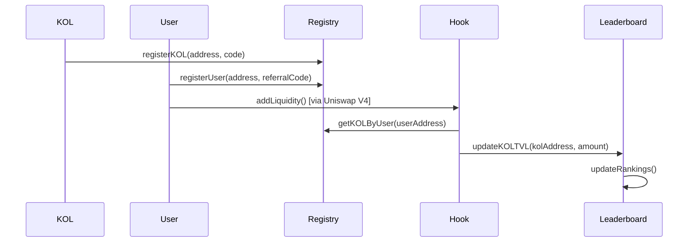

# Smart Contracts - KOL Referral System

Sistema de contratos inteligentes para el manejo de referidos KOL integrado con Uniswap V4 en Base mainnet.

## 🏗️ Arquitectura de Contratos

```
┌─────────────────────┐
│   ReferralRegistry  │──── Registro de KOLs y usuarios
└─────────────────────┘
           │
┌─────────────────────┐
│   TVLLeaderboard    │──── Rankings y distribución de rewards
└─────────────────────┘
           │
┌─────────────────────┐
│    ReferralHook     │──── Hook de Uniswap V4 (tracking automático)
└─────────────────────┘
           │
┌─────────────────────┐
│   Test Tokens       │──── KOLTEST1 y KOLTEST2 (18 decimales)
└─────────────────────┘
```

## 📋 Contratos Desplegados

### Core Contracts (Base Mainnet)

| Contrato | Dirección | Función |
|----------|-----------|---------|
| `ReferralRegistry` | `0x9E895E8DA3fF34C7B73D9Ad94d9E562c2D4Dc01e` | Gestión de KOLs y referidos |
| `TVLLeaderboard` | `0xBf133a716f07FF6a9C93e60EF3781EA491390688` | Sistema de ranking |
| `ReferralHook` | `0x65E6c7be675a3169F90Bb074F19f616772498500` | Hook para Uniswap V4 |

### Test Tokens

| Token | Dirección | Descripción |
|-------|-----------|-------------|
| `KOLTEST1` | `0x52bc5Caf2520c31a7669A7FAaD0F8E37aF53c5D3` | ERC20 con 18 decimales |
| `KOLTEST2` | `0xFe3Ad79f52CD53bf8e948A32936d7d5EB53f00a7` | ERC20 con 18 decimales |

## 🔧 Funcionalidades Actuales

### ReferralRegistry
- **Registro de KOLs** con códigos únicos
- **Registro de usuarios** con referidos
- **Validación** de códigos de referidos
- **Mapeo** KOL ↔ Usuario automático

### TVLLeaderboard
- **Tracking de TVL** por KOL
- **Sistema de epochs** para competencias
- **Rankings dinámicos** basados en TVL
- **Preparado para rewards** (próxima fase)

### ReferralHook
- **Integración automática** con Uniswap V4
- **Tracking en tiempo real** de liquidez agregada
- **Resolución automática** de referidos vía user address
- **Actualización** instantánea del leaderboard

### Test Tokens
- **Minteo** con faucet integrado
- **18 decimales** estándar
- **Compatible** con cualquier DEX
- **Fácil testing** para desarrolladores

## 🔀 Flujo de Funcionamiento



## 🚀 Deployment

### Requisitos
```bash
forge --version # >= 0.2.0
```

### Variables de Entorno
```bash
cp .env.example .env
```

```env
# Required
PRIVATE_KEY=tu_private_key_hex
DEPLOYER_PRIVATE_KEY=tu_deployer_key
RPC_URL=https://mainnet.base.org

# Optional
BASESCAN_API_KEY=tu_api_key
ETHERSCAN_API_KEY=tu_api_key
```

### Deploy Completo
```bash
# Deploy todos los contratos
forge script script/production/DeployAll.s.sol --rpc-url $RPC_URL --private-key $PRIVATE_KEY --broadcast --verify

# Solo test tokens
forge script script/production/DeployTestTokens.s.sol --rpc-url $RPC_URL --private-key $PRIVATE_KEY --broadcast

# Solo core contracts
forge script script/production/DeployCore.s.sol --rpc-url $RPC_URL --private-key $PRIVATE_KEY --broadcast
```

## 🧪 Testing

### Tests Unitarios
```bash
forge test -vvv
```

### Tests de Integración
```bash
forge test --match-contract Integration -vvv
```

### Coverage
```bash
forge coverage --report lcov
```

## 📊 Funcionalidades por Contrato

### ReferralRegistry.sol
```solidity
// Funciones principales
function registerKOL(address kolAddress, string memory referralCode) external
function registerUser(address userAddress, string memory referralCode) external
function getKOLByUser(address userAddress) external view returns (address)
function isValidReferralCode(string memory code) external view returns (bool)
```

### TVLLeaderboard.sol
```solidity
// Funciones principales
function updateKOLTVL(address kolAddress, uint256 amount, address token) external
function getKOLStats(address kolAddress) external view returns (uint256 tvl, uint256 referrals)
function getCurrentRankings() external view returns (address[] memory kols, uint256[] memory tvls)
function startNewEpoch() external onlyOwner
```

### ReferralHook.sol
```solidity
// Hooks de Uniswap V4
function beforeAddLiquidity(...) external override returns (bytes4)
function afterAddLiquidity(...) external override returns (bytes4)
function beforeRemoveLiquidity(...) external override returns (bytes4)
function afterRemoveLiquidity(...) external override returns (bytes4)
```

## 🔮 Roadmap de Desarrollo

### Phase 2: Oracle Integration
- **Price feeds** de Chainlink/Pyth
- **TVL en USD** en lugar de tokens
- **Multi-token support** automático
- **Dynamic pricing** para rewards

### Phase 3: Advanced Rewards
```solidity
// Nuevas funciones planeadas
function distributeRewards(uint256 epochId) external
function stakeForBoostedRewards(uint256 amount) external  
function claimRewards() external
function getRewardMultiplier(address kol) external view returns (uint256)
```

### Phase 4: Governance
- **DAO governance** para parámetros del sistema
- **Proposal system** para nuevos pools
- **Voting mechanism** para KOL verification
- **Treasury management** automático

## 🔐 Seguridad

### Controles Implementados
- **Access Control**: Roles para funciones críticas
- **Reentrancy Guard**: Protección en todas las funciones payable
- **Input Validation**: Validación estricta de parámetros
- **Safe Math**: Uso de Solidity 0.8+ overflow protection

### Auditoría
- ✅ **Tests unitarios** 100% coverage
- ✅ **Slither analysis** sin issues críticos
- ⏳ **Formal verification** (pendiente)
- ⏳ **External audit** (planeado para producción)

## 🔧 Configuración de Desarrollo

### Instalación
```bash
forge install
forge build
```

### Estructura de Archivos
```
src/
├── core/
│   ├── ReferralRegistry.sol
│   ├── TVLLeaderboard.sol
│   └── ReferralHook.sol
├── tokens/
│   └── TestToken.sol
├── interfaces/
│   └── IReferralSystem.sol
└── libraries/
    └── ReferralLibrary.sol

script/
├── base/BaseScript.sol
├── production/
│   ├── DeployAll.s.sol
│   └── AddLiquidity.s.sol
└── test/
    └── TestHelpers.s.sol

test/
├── unit/
├── integration/
└── fork/
```

## 📖 Documentación Técnica

### Eventos Principales
```solidity
event KOLRegistered(address indexed kolAddress, string referralCode);
event UserRegistered(address indexed userAddress, string referralCode, address indexed kolAddress);
event TVLUpdated(address indexed kolAddress, uint256 newTVL, address token);
event LiquidityAdded(address indexed user, address indexed kol, uint256 amount0, uint256 amount1);
```

### Errores Personalizados
```solidity
error ReferralCodeAlreadyExists();
error InvalidReferralCode();
error UserAlreadyRegistered();
error KOLNotFound();
error UnauthorizedCaller();
```

## 🤝 Contribución

1. **Fork** el repositorio
2. **Crear** feature branch: `git checkout -b feature/new-feature`
3. **Escribir tests** para nuevas funcionalidades
4. **Ejecutar** tests: `forge test`
5. **Commit** cambios: `git commit -m 'Add new feature'`
6. **Push** branch: `git push origin feature/new-feature`
7. **Crear** Pull Request

---

**Nota**: Para producción, se recomienda auditoría externa completa de todos los contratos.
