# Smart Contracts - KOL Referral System

Complete set of smart contracts for the KOL referral system with Uniswap V4 integration on Base mainnet.

## 📋 Contract Overview

### Core Contracts

| Contract | Purpose | Address (Base) |
|----------|---------|-----------------|
| **ReferralRegistry** | Registration and management of KOLs and users | `0x9E895E8DA3fF34C7B73D9Ad94d9E562c2D4Dc01e` |
| **TVLLeaderboard** | Ranking calculation and rewards management | `0xBf133a716f07FF6a9C93e60EF3781EA491390688` |
| **ReferralHook** | Uniswap V4 hook for TVL tracking | `0x65E6c7be675a3169F90Bb074F19f616772498500` |

### Test Tokens

| Token | Symbol | Address | Decimals |
|-------|--------|---------|----------|
| **KOL Test Token 1** | KOLTEST1 | `0x52bc5Caf2520c31a7669A7FAaD0F8E37aF53c5D3` | 18 |
| **KOL Test Token 2** | KOLTEST2 | `0xFe3Ad79f52CD53bf8e948A32936d7d5EB53f00a7` | 18 |

## 🏗️ Architecture

```
┌─────────────────────┐
│   ReferralRegistry  │ ← KOL and user registration
└─────────┬───────────┘
          │
          ▼
┌─────────────────────┐
│   TVLLeaderboard    │ ← Rankings and rewards
└─────────┬───────────┘
          │
          ▼
┌─────────────────────┐
│    ReferralHook     │ ← Uniswap V4 integration
└─────────────────────┘
```

## 🔧 Core Functionality

### 1. ReferralRegistry

**Registration and management system for KOLs and users.**

#### Key Functions:
```solidity
// Register as KOL with unique code
function registerKOL(string calldata _referralCode) external

// Register user with KOL referral code
function registerUserWithReferral(string calldata _referralCode) external

// Check if user is referred by a KOL
function isUserReferred(address _user) external view returns (bool)

// Get KOL who referred the user
function getReferrer(address _user) external view returns (address)
```

#### Events:
- `KOLRegistered(address kol, string referralCode)`
- `UserReferred(address user, address kol, string referralCode)`

### 2. TVLLeaderboard

**Ranking system with automatic rewards calculation.**

#### Key Functions:
```solidity
// Update TVL for a KOL (called by hook)
function updateTVL(address _kol, uint256 _newTVL) external

// Get KOL statistics
function getKOLStats(address _kol) external view returns (uint256 totalTVL, uint256 referredUsers)

// Get top KOLs with pagination
function getTopKOLs(uint256 _start, uint256 _limit) external view returns (LeaderboardEntry[])
```

#### Structures:
```solidity
struct LeaderboardEntry {
    address kol;
    uint256 totalTVL;
    uint256 referredUsers;
    uint256 rank;
}
```

### 3. ReferralHook

**Uniswap V4 hook for automatic TVL tracking.**

#### Hook Permissions:
```solidity
uint160 public constant HOOK_PERMISSIONS = 
    BEFORE_MODIFY_POSITION_FLAG | 
    AFTER_MODIFY_POSITION_FLAG;
```

#### Key Functions:
```solidity
// Called before position modification
function beforeModifyPosition(
    address sender,
    PoolKey calldata key,
    IPoolManager.ModifyPositionParams calldata params,
    bytes calldata hookData
) external returns (bytes4)

// Called after position modification
function afterModifyPosition(
    address sender,
    PoolKey calldata key,
    IPoolManager.ModifyPositionParams calldata params,
    BalanceDelta delta,
    bytes calldata hookData
) external returns (bytes4)
```

## 🔄 Operation Flow

### 1. KOL Registration

```mermaid
sequenceDiagram
    participant K as KOL
    participant RR as ReferralRegistry
    
    K->>RR: registerKOL("MY_CODE")
    RR->>RR: Validate unique code
    RR->>K: ✅ KOL registered
```


### 2. User Registration


### 3. Liquidity Addition


## 🧪 Testing

### Local Testing

```bash
# Install dependencies
forge install

# Run all tests
forge test -vvv

# Test specific contract
forge test --match-contract ReferralRegistryTest -vvv

# Test with gas report
forge test --gas-report
```

### Test Coverage

```bash
# Generate coverage report
forge coverage

# Detailed coverage
forge coverage --report debug
```

### Main Test Suites

1. **ReferralRegistryTest.sol**
   - KOL registration validation
   - User referral system
   - Access control

2. **TVLLeaderboardTest.sol**
   - TVL calculations
   - Ranking system
   - Rewards distribution

3. **ReferralHookTest.sol**
   - Hook integration
   - Position tracking
   - Event emissions

## 🚀 Deployment

### Local Deployment

```bash
# Set environment variables
cp .env.example .env

# Deploy to local network
forge script script/Deploy.s.sol --rpc-url http://localhost:8545 --broadcast

# Deploy to Base mainnet
forge script script/Deploy.s.sol --rpc-url $BASE_RPC_URL --broadcast --verify
```

### Environment Variables

```env
# Required for deployment
PRIVATE_KEY=your_private_key_here
BASE_RPC_URL=https://mainnet.base.org
BASESCAN_API_KEY=your_basescan_api_key

# Uniswap V4 addresses (Base)
POOL_MANAGER=0x498581fF718922c3f8e6A244956aF099B2652b2b
POSITION_MANAGER=0x7C5f5A4bBd8fD63184577525326123B519429bDc
```

### Deployment Scripts

| Script | Purpose |
|--------|---------|
| `Deploy.s.sol` | Complete system deployment |
| `CreatePool.s.sol` | Create test token pool |
| `AddLiquidity.s.sol` | Add initial liquidity |
| `TestSystem.s.sol` | End-to-end system testing |

## 🔐 Security Features

### Access Control
- **OnlyRegistry**: Only ReferralRegistry can update TVL
- **OnlyHook**: Only ReferralHook can call certain functions
- **OnlyOwner**: Administrative functions

### Validations
- **Unique codes**: No duplicate referral codes
- **Address validation**: Non-zero address checks
- **Reentrancy protection**: In critical functions
- **Input sanitization**: String and number validation

### Audit Points
```solidity
// Example: TVL update with validation
function updateTVL(address _kol, uint256 _newTVL) external onlyHook {
    require(_kol != address(0), "Invalid KOL address");
    require(_newTVL > 0, "TVL must be positive");
    
    // Update logic with overflow protection
    kolStats[_kol].totalTVL = _newTVL;
    
    emit TVLUpdated(_kol, _newTVL);
}
```

## 📊 Gas Optimization

### Efficient Storage
- Packed structs for gas savings
- Minimal storage reads/writes
- Efficient mapping usage

### Hook Optimization
```solidity
// Optimized hook with minimal gas usage
function afterModifyPosition(/*...*/) external override returns (bytes4) {
    // Only essential logic in hooks
    if (hookData.length > 0) {
        address user = abi.decode(hookData, (address));
        _updateUserTVL(user, delta);
    }
    
    return ReferralHook.afterModifyPosition.selector;
}
```

## 🔮 Future Roadmap

### Phase 2: Advanced Features
- **Multi-token support**: Beyond test tokens
- **Dynamic rewards**: Configurable reward rates
- **Time-based epochs**: Seasonal competitions
- **Staking integration**: KOL token staking

### Phase 3: Oracle Integration
- **Price feeds**: Chainlink/Pyth integration
- **USD TVL calculation**: Real-world value tracking
- **Multi-chain support**: Deployment on other networks

### Phase 4: Advanced Mechanisms
- **Governance token**: Community voting
- **Advanced hooks**: Fee redistribution
- **Cross-chain tracking**: Multi-chain referrals
- **NFT rewards**: Unique achievement badges

## 🤝 Contributing

### Development Setup
```bash
# Fork and clone
git clone your-fork-url
cd kol-referral-system

# Install dependencies
forge install

# Create feature branch
git checkout -b feature/new-feature

# Make changes and test
forge test

# Commit and push
git commit -m "Add new feature"
git push origin feature/new-feature
```

### Code Standards
- Follow Solidity style guide
- 100% test coverage for new features
- Gas optimization where possible
- Complete natspec documentation

## 📝 License

MIT License - see LICENSE file for details.

---

**Note**: These contracts are deployed on Base mainnet for demonstration. For production use, complete professional audit is recommended.
