# Sesión 10: MEV - Coincidence of Wants (CoW)
## Uniswap Foundation - Atrium Academy

---

## 🎯 Objetivos de la Lección

Al finalizar esta sesión, podrás:

- ✅ **Aprender sobre CoW** como concepto económico
- ✅ **Entender CoWSwap** a alto nivel
- ✅ **Diseñar un mecanismo CoW** usando Uniswap hooks
- ✅ **Implementar P2P matching** onchain
- ✅ **Mitigar MEV** a través de direct trading

---

## 📚 Contenido de la Sesión

### 1. Coincidence of Wants Fundamentals
### 2. CoWSwap Analysis
### 3. Hook-Based CoW Design
### 4. Implementation Strategy
### 5. Economic Benefits

**Nota:** Esta es una **lección conceptual** - exploraremos CoW mechanisms para MEV protection.

---

## 🤝 Coincidence of Wants Fundamentals

### ¿Qué es Coincidence of Wants?

**Definición:** Fenómeno económico donde dos partes poseen items que la otra parte quiere, permitiendo intercambio directo.

#### Concepto Histórico

**Barter System:**
```
Antes del dinero: Intercambio directo de bienes
Chickens ↔ Cotton
Wheat ↔ Tools
Direct value exchange sin intermediarios
```

#### En DeFi Context

**Simple P2P Trade:**
```
Meredith: Wants to sell 1 ETH for 3,500 DAI
Eli: Wants to buy 1 ETH for 3,500 DAI
Result: Direct trade, zero slippage, no fees
```

### Tipos de CoW

#### 1. **Simple P2P Exchange**


**Beneficios:**
- ✅ Zero slippage
- ✅ No LP fees
- ✅ Instant settlement
- ✅ MEV protection

#### 2. **Closed Loop Ring**

```mermaid
graph TD
    A[Eli: ETH → DAI] --> B[Edith: USDC → ETH]
    B --> C[Lily: COW → USDC]
    C --> D[Chow: DAI → COW]
    D --> A
    
    style A fill:#e8f5e8
    style B fill:#fff3e0
    style C fill:#f3e5f5
    style D fill:#e1f5fe
```



**Example Ring:**
```
Eli: Sell ETH for DAI
Edith: Sell USDC for ETH  
Lily: Sell COW for USDC
Chow: Sell DAI for COW
```

#### 3. **Complex Multi-Ring**

**Features:**
- Multiple interconnected rings
- Cross-ring arbitrage
- Optimal path finding
- Maximum efficiency

### CoW vs Traditional AMM

#### Pros ✅

1. **Zero Slippage**
   ```
   Direct P2P: No price impact
   AMM Alternative: 0.1-5% slippage
   ```

2. **No LP Fees**
   ```
   Direct Trade: 0% fees
   AMM Alternative: 0.05-1% fees
   ```

3. **MEV Protection**
   ```
   P2P Matching: Cannot be sandwiched
   AMM Swaps: Vulnerable to MEV
   ```

#### Cons ❌

1. **Path Optimization Complexity**
   ```
   Challenge: NP-hard optimization problem
   Solution: Heuristic algorithms
   ```

2. **Non-Instant Execution**
   ```
   Issue: Requires matching window
   Tradeoff: Better price vs speed
   ```

3. **Liquidity Dependency**
   ```
   Limitation: Needs matching orders
   Fallback: Traditional AMM liquidity
   ```

---

## 🐄 CoWSwap Analysis

### CoWSwap Architecture

#### High-Level Workflow


#### Detailed Process

**1. 📝 Intent Submission**
```typescript
interface UserIntent {
    sellToken: address;
    buyToken: address;
    sellAmount: bigint;
    buyAmount: bigint;
    validTo: number;
    appData: bytes;
    feeAmount: bigint;
    kind: 'sell' | 'buy';
    partiallyFillable: boolean;
}
```

**2. 📦 Batch Formation**
```
Time Window: 30 seconds
Max Orders: 100 per batch
Grouping: By settlement efficiency
```

**3. 🧮 Solver Competition**
```
Objective: Maximize user surplus
Constraints: Economic feasibility
Winner: Best total output
Reward: COW token incentives
```

**4. 🔄 CoW Matching**
```solidity
// Simplified matching logic
for (Intent intentA : batch) {
    for (Intent intentB : batch) {
        if (canMatch(intentA, intentB)) {
            executeP2P(intentA, intentB);
        }
    }
}
```

**5. 🌊 Liquidity Routing**
```
Remaining orders → Best available liquidity
Sources: Uniswap, Balancer, Curve, 1inch, CEXs
Optimization: Minimal price impact
```

### CoWSwap Benefits

#### For Users
- **Better prices:** CoW matching + optimal routing
- **MEV protection:** Batch execution prevents sandwiching  
- **Gas efficiency:** Shared settlement costs
- **No failed transactions:** Solvers guarantee execution

#### For Ecosystem
- **Reduced MEV:** Less toxic orderflow
- **Improved efficiency:** Better price discovery
- **Innovation:** Intent-based trading model

---

## 🪝 CoW in Uniswap v4 Hooks

### Design Goals

**Objective:** Implement onchain CoW matching for Uniswap pools

#### Target Features

1. **P2P Matching**
   ```
   Alice: A → B (willing to wait 10 blocks)
   Bob: B → A (immediate)
   Result: Direct P2P execution
   ```

2. **Fallback Execution**
   ```
   If no match after timeout → Execute via AMM
   If price moved unfavorably → Return tokens or hold as limit order
   ```

3. **Regular Swap Compatibility**
   ```
   Users without CoW intent → Normal AMM execution
   Existing integrations → Unchanged behavior
   ```

### User Flow Design


### Implementation Strategy

#### 1. **Intent Signaling via hookData**

```solidity
struct CoWIntent {
    uint256 maxWaitBlocks;     // Willing to wait up to N blocks
    uint256 minPrice;          // Minimum acceptable price
    uint256 maxPrice;          // Maximum acceptable price  
    bool allowPartialFill;     // Accept partial matching
    bool fallbackToAMM;        // Use AMM if no CoW match
}

function beforeSwap(
    address sender,
    PoolKey calldata key,
    IPoolManager.SwapParams calldata params,
    bytes calldata hookData
) external override returns (bytes4, BeforeSwapDelta, uint24) {
    
    if (hookData.length == 0) {
        // Regular swap - check for CoW opportunities
        return _checkCoWMatching(sender, key, params);
    } else {
        // CoW intent - decode and process
        CoWIntent memory intent = abi.decode(hookData, (CoWIntent));
        return _processCoWIntent(sender, key, params, intent);
    }
}
```

#### 2. **Pending Order Management**

```solidity
struct PendingOrder {
    address user;
    bool zeroForOne;
    uint256 amountIn;
    uint256 minAmountOut;
    uint256 expiryBlock;
    uint256 minPrice;
    uint256 maxPrice;
    bool partialFillable;
    bool fallbackToAMM;
    uint256 filledAmount;
}

mapping(bytes32 => PendingOrder) public pendingOrders;
mapping(PoolId => bytes32[]) public poolPendingOrders;
```

#### 3. **CoW Matching Logic**

```solidity
function _checkCoWMatching(
    address sender,
    PoolKey calldata key,
    IPoolManager.SwapParams calldata params
) internal returns (bytes4, BeforeSwapDelta, uint24) {
    
    PoolId poolId = key.toId();
    bytes32[] storage pendingOrderIds = poolPendingOrders[poolId];
    
    for (uint i = 0; i < pendingOrderIds.length; i++) {
        bytes32 orderId = pendingOrderIds[i];
        PendingOrder storage order = pendingOrders[orderId];
        
        if (_canMatch(order, params)) {
            return _executeCoWMatch(sender, key, params, orderId);
        }
    }
    
    // No match found - execute normally
    return (this.beforeSwap.selector, BeforeSwapDeltaLibrary.ZERO_DELTA, 0);
}

function _canMatch(
    PendingOrder memory order,
    IPoolManager.SwapParams calldata params
) internal pure returns (bool) {
    // Check if directions are opposite
    bool directionsMatch = (order.zeroForOne != params.zeroForOne);
    
    // Check if amounts are compatible
    uint256 swapAmount = params.amountSpecified < 0 
        ? uint256(-params.amountSpecified)
        : uint256(params.amountSpecified);
    
    bool amountsCompatible = (swapAmount >= order.minAmountOut) ||
                           (order.partialFillable && swapAmount > 0);
    
    // Check if order hasn't expired
    bool notExpired = block.number <= order.expiryBlock;
    
    return directionsMatch && amountsCompatible && notExpired;
}
```

#### 4. **P2P Execution**

```solidity
function _executeCoWMatch(
    address taker,
    PoolKey calldata key,
    IPoolManager.SwapParams calldata params,
    bytes32 orderId
) internal returns (bytes4, BeforeSwapDelta, uint24) {
    
    PendingOrder storage order = pendingOrders[orderId];
    
    uint256 takerAmountIn = params.amountSpecified < 0 
        ? uint256(-params.amountSpecified)
        : uint256(params.amountSpecified);
    
    // Calculate optimal match amounts
    uint256 matchAmount = _calculateMatchAmount(order, takerAmountIn);
    uint256 makerAmountOut = matchAmount;
    uint256 takerAmountOut = (order.amountIn * matchAmount) / order.minAmountOut;
    
    // Execute P2P transfer
    if (params.zeroForOne) {
        // Taker: token0 → token1, Maker: token1 → token0
        key.currency0.settle(poolManager, taker, takerAmountIn, false);
        key.currency1.take(poolManager, taker, takerAmountOut, false);
        
        key.currency1.settle(poolManager, order.user, makerAmountOut, false);
        key.currency0.take(poolManager, order.user, matchAmount, false);
    } else {
        // Taker: token1 → token0, Maker: token0 → token1
        key.currency1.settle(poolManager, taker, takerAmountIn, false);
        key.currency0.take(poolManager, taker, takerAmountOut, false);
        
        key.currency0.settle(poolManager, order.user, makerAmountOut, false);
        key.currency1.take(poolManager, order.user, matchAmount, false);
    }
    
    // Update or remove order
    order.filledAmount += matchAmount;
    if (order.filledAmount >= order.amountIn) {
        _removeOrder(orderId);
    }
    
    // Return delta that consumed the input
    BeforeSwapDelta delta = toBeforeSwapDelta(
        int128(-params.amountSpecified),
        int128(int256(takerAmountOut))
    );
    
    emit CoWMatch(orderId, taker, matchAmount, takerAmountOut);
    
    return (this.beforeSwap.selector, delta, 0);
}
```

### Complete Hook Implementation

```solidity
// SPDX-License-Identifier: MIT
pragma solidity ^0.8.0;

import {BaseHook} from "v4-periphery/src/utils/BaseHook.sol";
import {BeforeSwapDelta, toBeforeSwapDelta} from "v4-core/types/BeforeSwapDelta.sol";
import {IPoolManager} from "v4-core/interfaces/IPoolManager.sol";
import {PoolKey} from "v4-core/types/PoolKey.sol";
import {PoolId, PoolIdLibrary} from "v4-core/types/PoolId.sol";
import {Currency, CurrencyLibrary} from "v4-core/types/Currency.sol";

contract CoWHook is BaseHook {
    using PoolIdLibrary for PoolKey;
    using CurrencyLibrary for Currency;
    
    struct CoWIntent {
        uint256 maxWaitBlocks;
        uint256 minPrice;
        uint256 maxPrice;
        bool allowPartialFill;
        bool fallbackToAMM;
    }
    
    struct PendingOrder {
        address user;
        bool zeroForOne;
        uint256 amountIn;
        uint256 minAmountOut;
        uint256 expiryBlock;
        uint256 minPrice;
        uint256 maxPrice;
        bool partialFillable;
        bool fallbackToAMM;
        uint256 filledAmount;
    }
    
    mapping(bytes32 => PendingOrder) public pendingOrders;
    mapping(PoolId => bytes32[]) public poolPendingOrders;
    mapping(address => bytes32[]) public userOrders;
    
    event CoWMatch(
        bytes32 indexed orderId,
        address indexed taker,
        uint256 matchAmount,
        uint256 outputAmount
    );
    
    event OrderPlaced(
        bytes32 indexed orderId,
        address indexed user,
        uint256 amountIn,
        uint256 minAmountOut,
        uint256 expiryBlock
    );
    
    constructor(IPoolManager _poolManager) BaseHook(_poolManager) {}
    
    function getHookPermissions() public pure override returns (Hooks.Permissions memory) {
        return Hooks.Permissions({
            beforeInitialize: false,
            afterInitialize: false,
            beforeAddLiquidity: false,
            afterAddLiquidity: false,
            beforeRemoveLiquidity: false,
            afterRemoveLiquidity: false,
            beforeSwap: true,
            afterSwap: true,
            beforeDonate: false,
            afterDonate: false,
            beforeSwapReturnDelta: true,
            afterSwapReturnDelta: false,
            afterAddLiquidityReturnDelta: false,
            afterRemoveLiquidityReturnDelta: false
        });
    }
    
    function beforeSwap(
        address sender,
        PoolKey calldata key,
        IPoolManager.SwapParams calldata params,
        bytes calldata hookData
    ) external override returns (bytes4, BeforeSwapDelta, uint24) {
        
        if (hookData.length == 0) {
            // Regular swap - check for CoW opportunities
            return _checkCoWMatching(sender, key, params);
        } else {
            // CoW intent - decode and process
            CoWIntent memory intent = abi.decode(hookData, (CoWIntent));
            return _processCoWIntent(sender, key, params, intent);
        }
    }
    
    function afterSwap(
        address,
        PoolKey calldata key,
        IPoolManager.SwapParams calldata,
        BalanceDelta,
        bytes calldata
    ) external override returns (bytes4, int128) {
        // Check for expired orders and execute via AMM if needed
        _processExpiredOrders(key);
        return (this.afterSwap.selector, 0);
    }
    
    function _checkCoWMatching(
        address sender,
        PoolKey calldata key,
        IPoolManager.SwapParams calldata params
    ) internal returns (bytes4, BeforeSwapDelta, uint24) {
        
        PoolId poolId = key.toId();
        bytes32[] storage pendingOrderIds = poolPendingOrders[poolId];
        
        for (uint i = 0; i < pendingOrderIds.length; i++) {
            bytes32 orderId = pendingOrderIds[i];
            PendingOrder storage order = pendingOrders[orderId];
            
            if (_canMatch(order, params)) {
                return _executeCoWMatch(sender, key, params, orderId);
            }
        }
        
        // No match found - execute normally
        return (this.beforeSwap.selector, BeforeSwapDeltaLibrary.ZERO_DELTA, 0);
    }
    
    function _processCoWIntent(
        address sender,
        PoolKey calldata key,
        IPoolManager.SwapParams calldata params,
        CoWIntent memory intent
    ) internal returns (bytes4, BeforeSwapDelta, uint24) {
        
        // First check for immediate matching
        (bytes4 selector, BeforeSwapDelta delta, uint24 fee) = _checkCoWMatching(sender, key, params);
        
        if (delta.getSpecifiedDelta() != 0) {
            // Match found - execute immediately
            return (selector, delta, fee);
        }
        
        // No immediate match - create pending order
        return _createPendingOrder(sender, key, params, intent);
    }
    
    function _createPendingOrder(
        address sender,
        PoolKey calldata key,
        IPoolManager.SwapParams calldata params,
        CoWIntent memory intent
    ) internal returns (bytes4, BeforeSwapDelta, uint24) {
        
        bytes32 orderId = keccak256(abi.encodePacked(
            sender,
            key.toId(),
            params.amountSpecified,
            block.timestamp,
            block.number
        ));
        
        uint256 amountIn = params.amountSpecified < 0 
            ? uint256(-params.amountSpecified)
            : uint256(params.amountSpecified);
        
        pendingOrders[orderId] = PendingOrder({
            user: sender,
            zeroForOne: params.zeroForOne,
            amountIn: amountIn,
            minAmountOut: 0, // Will be calculated
            expiryBlock: block.number + intent.maxWaitBlocks,
            minPrice: intent.minPrice,
            maxPrice: intent.maxPrice,
            partialFillable: intent.allowPartialFill,
            fallbackToAMM: intent.fallbackToAMM,
            filledAmount: 0
        });
        
        poolPendingOrders[key.toId()].push(orderId);
        userOrders[sender].push(orderId);
        
        // Lock input tokens
        Currency inputCurrency = params.zeroForOne ? key.currency0 : key.currency1;
        inputCurrency.settle(poolManager, sender, amountIn, false);
        inputCurrency.take(poolManager, address(this), amountIn, true);
        
        BeforeSwapDelta delta = toBeforeSwapDelta(
            int128(-params.amountSpecified),
            int128(0)
        );
        
        emit OrderPlaced(orderId, sender, amountIn, 0, block.number + intent.maxWaitBlocks);
        
        return (this.beforeSwap.selector, delta, 0);
    }
    
    // Additional helper functions...
    function _canMatch(PendingOrder memory order, IPoolManager.SwapParams calldata params) internal pure returns (bool) {
        // Implementation details...
        return true; // Simplified
    }
    
    function _executeCoWMatch(address taker, PoolKey calldata key, IPoolManager.SwapParams calldata params, bytes32 orderId) internal returns (bytes4, BeforeSwapDelta, uint24) {
        // Implementation details...
        return (this.beforeSwap.selector, BeforeSwapDeltaLibrary.ZERO_DELTA, 0); // Simplified
    }
    
    function _processExpiredOrders(PoolKey calldata key) internal {
        // Implementation details...
    }
}
```

---

## 💰 Economic Benefits

### For Users

#### Direct Benefits
```
Zero Slippage: P2P execution at exact prices
No LP Fees: Direct trade bypasses AMM fees
MEV Protection: Cannot be sandwiched
Better Execution: Optimal price discovery
```

#### Example Savings
```
Traditional AMM:
- Slippage: 0.5% = $50 on $10k trade
- LP Fees: 0.3% = $30 on $10k trade  
- Total Cost: $80

CoW Matching:
- Slippage: 0% = $0
- LP Fees: 0% = $0
- Total Cost: $0
- Savings: $80 per $10k trade
```

### For LPs

#### Impact Analysis
```
Reduced Volume: Some trades bypass AMM
Fee Impact: Lower total fees collected
Offset: Higher quality orderflow remains
Net Effect: Depends on CoW match rate
```

### For Ecosystem

#### Network Effects
```
Reduced MEV: Less toxic orderflow
Better Prices: More efficient price discovery
Innovation: New trading primitives
Adoption: Improved user experience
```

---

## 🚀 Advanced Improvements

### 1. Ring Matching Algorithm

```solidity
contract RingMatcher {
    struct Ring {
        bytes32[] orderIds;
        uint256 totalValue;
        bool isValid;
    }
    
    function findOptimalRings(
        bytes32[] memory orderIds
    ) external view returns (Ring[] memory) {
        // Implement ring detection algorithm
        // Use graph theory for cycle detection
        // Optimize for maximum value extraction
    }
}
```

### 2. Dynamic Pricing

```solidity
function calculateCoWPrice(
    PendingOrder memory order,
    IPoolManager.SwapParams calldata params
) internal view returns (uint256) {
    // Use AMM price as reference
    uint256 ammPrice = getAMMPrice(order.poolKey);
    
    // Apply improvement over AMM
    uint256 improvement = (ammPrice * 50) / 10000; // 0.5% better
    
    return order.zeroForOne 
        ? ammPrice + improvement
        : ammPrice - improvement;
}
```

### 3. Batch Processing

```solidity
function processBatch(
    PoolKey calldata key,
    bytes32[] calldata orderIds
) external {
    // Group compatible orders
    Ring[] memory rings = findOptimalRings(orderIds);
    
    // Execute all rings atomically
    for (uint i = 0; i < rings.length; i++) {
        executeRing(rings[i]);
    }
    
    // Handle remaining orders
    processRemainingOrders(key, orderIds);
}
```

---

## 🎯 Ideas para Capstone Projects

### 🥉 Proyecto Básico: Simple CoW Hook

**Features:**
- ✅ P2P matching for opposite direction swaps
- ✅ Basic pending order management
- ✅ Timeout and fallback to AMM
- ✅ Simple testing framework

**Complejidad:** Intermedia
**Tiempo:** 3-4 semanas

### 🥈 Proyecto Intermedio: Advanced CoW Matching

**Features:**
- ✅ Ring matching algorithms
- ✅ Partial fill capabilities
- ✅ Dynamic pricing mechanisms
- ✅ Batch processing optimization
- ✅ Comprehensive analytics

**Complejidad:** Avanzada
**Tiempo:** 6-8 semanas

### 🥇 Proyecto Avanzado: Full CoW Protocol

**Features:**
- ✅ Multi-pool CoW coordination
- ✅ Cross-chain order matching
- ✅ Solver network integration
- ✅ MEV protection guarantees
- ✅ Governance and tokenomics
- ✅ Professional UI/UX

**Complejidad:** Experto
**Tiempo:** 10-16 semanas

---

## 🎓 Conclusión

### Key Takeaways

1. **🤝 CoW Benefits:** Zero slippage, no fees, MEV protection
2. **🔄 P2P Matching:** Direct trade execution between users
3. **🪝 Hook Implementation:** Feasible with Return Delta hooks
4. **💰 Economic Value:** Significant savings for users
5. **🛡️ MEV Mitigation:** Natural protection from sandwich attacks

### Implementation Insights

**Technical:**
- hookData for intent signaling
- Pending order management
- P2P execution logic
- Fallback mechanisms

**Economic:**
- Better prices for users
- Reduced LP fee dependency
- MEV protection value
- Network effect potential

### Future Opportunities

**Research Areas:**
- Optimal matching algorithms
- Cross-pool coordination
- Incentive mechanism design
- Decentralized solver networks

**Business Potential:**
- CoW-as-a-Service platforms
- Intent-based trading interfaces
- MEV protection services
- Institutional trading tools

---

*Fuente: Uniswap Foundation - Atrium Academy | v4 Hook Incubator* 