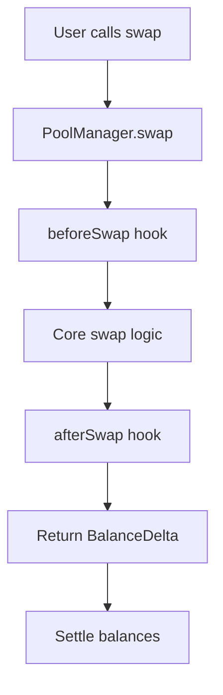
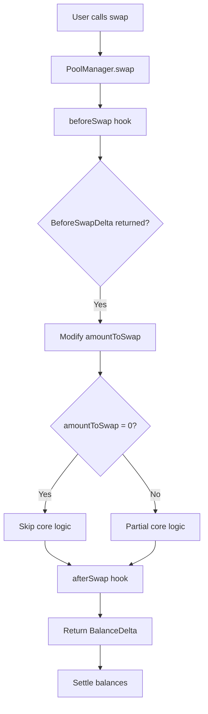

# Sesión 8: Custom Curve - CSMM (Constant Sum Market Maker)
## Uniswap Foundation - Atrium Academy

---

## 🎯 Objetivos de la Lección

Al finalizar esta sesión, podrás:

- ✅ **Aprender sobre Return Delta hooks** (NoOp hooks)
- ✅ **Entender la diferencia** entre BalanceDelta y BeforeSwapDelta
- ✅ **Usar beforeSwapReturnDelta hook** para customizar swap logic
- ✅ **Implementar una curva de pricing CSMM** simplificada
- ✅ **Dominar conceptos avanzados** de hook development

---

## 📚 Contenido de la Sesión

### 1. Return Delta Hooks (NoOp Hooks)
### 2. BeforeSwapDelta vs BalanceDelta
### 3. Custom Pricing Curves
### 4. CSMM Implementation
### 5. Testing & Deployment

**Nota:** Esta es una **lección práctica** - escribiremos código completo funcional para un custom AMM.

---

## 🔄 Return Delta Hooks (NoOp Hooks)

### ¿Qué son NoOp Hooks?

**NoOp = No Operation** - Término de Computer Science que se refiere a machine instructions que le piden a la máquina hacer "nada".

#### En el Contexto de Uniswap v4

**NoOp Hooks** tienen la habilidad de pedirle al **PoolManager** que "skip" ciertas partes de la lógica core.

**Ejemplo:** Skip core swap logic y usar custom pricing curve

### Tipos de Return Delta Hooks

#### 4 Tipos Disponibles

1. **`beforeSwapReturnDelta`**
   - Bypass parcial o completo de core swap logic
   - Maneja swap request dentro de beforeSwap

2. **`afterSwapReturnDelta`** 
   - Extrae tokens del swap output
   - Pide más input tokens al usuario
   - Agrega tokens adicionales al output

3. **`afterAddLiquidityReturnDelta`**
   - Cobra fees adicionales al agregar liquidez
   - Envía tokens bonus al usuario

4. **`afterRemoveLiquidityReturnDelta`**
   - Similar a afterAddLiquidity
   - Para operaciones de remove liquidity

### Focus de Hoy: beforeSwapReturnDelta

**¿Por qué es el más importante?**
- Más poderoso de los Return Delta hooks
- Usado en mayoría de proyectos con custom curves
- Permite complete control sobre swap execution

---

## 🔄 BeforeSwapDelta vs BalanceDelta

### BalanceDelta (Familiar)

**Formato:** `(amount0, amount1)`
- Siempre ordenado por token0 y token1
- Representa delta después de una acción
- Usuario debe settle estos balances

### BeforeSwapDelta (Nuevo)

**Formato:** `(amountSpecified, amountUnspecified)`
- **NO** ordenado por token0/token1
- Ordenado por "specified" vs "unspecified" token

#### ¿Qué es "Specified Token"?

**Depende del tipo de swap:**

```solidity
// 4 tipos de swap configurations:
1. Exact Input Zero for One  (zeroForOne=true, amountSpecified<0)
2. Exact Output Zero for One (zeroForOne=true, amountSpecified>0)
3. Exact Input One for Zero  (zeroForOne=false, amountSpecified<0)
4. Exact Output One for Zero (zeroForOne=false, amountSpecified>0)
```

#### Ejemplos de Specified Token

**Case 1: Exact Input Zero for One**
```
zeroForOne = true, amountSpecified = -100
Specified Token = token0 (user specifies input amount)
Unspecified Token = token1 (output amount calculated)
```

**Case 2: Exact Output Zero for One**
```
zeroForOne = true, amountSpecified = +100  
Specified Token = token1 (user specifies output amount)
Unspecified Token = token0 (input amount calculated)
```

---

## 🔧 Core Swap Logic Flow

### Regular Swap Flow (Sin Return Delta)



### Return Delta Flow (Con beforeSwapReturnDelta)



### Análisis del PoolManager Code

#### swap() Function

```solidity
function swap(PoolKey memory key, IPoolManager.SwapParams memory params, bytes calldata hookData)
    external
    onlyWhenUnlocked
    noDelegateCall
    returns (BalanceDelta swapDelta)
{
    BeforeSwapDelta beforeSwapDelta;
    {
        int256 amountToSwap;
        uint24 lpFeeOverride;
        
        // Key insight: amountToSwap can be modified by hook
        (amountToSwap, beforeSwapDelta, lpFeeOverride) = key.hooks.beforeSwap(key, params, hookData);
        
        // Core swap uses amountToSwap, NOT params.amountSpecified
        swapDelta = _swap(
            pool,
            id,
            Pool.SwapParams({
                tickSpacing: key.tickSpacing,
                zeroForOne: params.zeroForOne,
                amountSpecified: amountToSwap, // ← Modified value
                sqrtPriceLimitX96: params.sqrtPriceLimitX96,
                lpFeeOverride: lpFeeOverride
            }),
            params.zeroForOne ? key.currency0 : key.currency1
        );
    }
}
```

#### Hooks.sol Logic

```solidity
function beforeSwap(IHooks self, PoolKey memory key, IPoolManager.SwapParams memory params, bytes calldata hookData)
    internal
    returns (int256 amountToSwap, BeforeSwapDelta hookReturn, uint24 lpFeeOverride)
{
    // Start with original amount
    amountToSwap = params.amountSpecified;
    
    if (self.hasPermission(BEFORE_SWAP_FLAG)) {
        // Call hook
        bytes memory result = callHook(self, abi.encodeCall(IHooks.beforeSwap, (msg.sender, key, params, hookData)));
        
        if (self.hasPermission(BEFORE_SWAP_RETURNS_DELTA_FLAG)) {
            hookReturn = BeforeSwapDelta.wrap(result.parseReturnDelta());
            
            int128 hookDeltaSpecified = hookReturn.getSpecifiedDelta();
            
            // Modify amountToSwap based on hook return
            if (hookDeltaSpecified != 0) {
                bool exactInput = amountToSwap < 0;
                amountToSwap += hookDeltaSpecified; // ← Key modification
                
                // Ensure swap type doesn't change
                if (exactInput ? amountToSwap > 0 : amountToSwap < 0) {
                    HookDeltaExceedsSwapAmount.selector.revertWith();
                }
            }
        }
    }
}
```

### Ejemplo Simplificado

#### Scenario: Alice quiere swap 1 Token A por Token B

**Regular Flow:**
```
1. User: amountSpecified = -1 (exact input)
2. PoolManager: amountToSwap = -1
3. Core logic: swap 1 A for X B
4. Result: BalanceDelta(-1 A, +X B)
```

**Return Delta Flow:**
```
1. User: amountSpecified = -1 (exact input)
2. Hook: returns BeforeSwapDelta(+1 A, -X B)
3. PoolManager: amountToSwap = -1 + 1 = 0
4. Core logic: SKIPPED (amountToSwap = 0)
5. Result: BalanceDelta(-1 A, +X B) from hook logic
```

**Key Insight:** Hook "consumed" el user's input y provided custom output

---

## 🔄 CSMM (Constant Sum Market Maker)

### ¿Qué es CSMM?

**CSMM = Constant Sum Market Maker**
- Pricing curve: `x + y = k` (vs CPMM: `x * y = k`)
- **Perfect para:** Stablecoins, pegged assets
- **Trade ratio:** Always 1:1

#### Comparación de Curves

**CPMM (Uniswap Standard):**
```
Price changes based on reserves ratio
More tokens = lower price impact
xy = k invariant
```

**CSMM (Today's Implementation):**
```
Fixed 1:1 price ratio
No price impact regardless of size
x + y = k invariant
```

### Use Cases Teóricos

✅ **Good for:**
- USDC ↔ DAI swaps
- stETH ↔ ETH swaps  
- Pegged asset pairs

❌ **Bad for:**
- Volatile asset pairs
- Production environments (depeg risk)
- Risk management

### Nuestro Simplified CSMM

**Even Simpler:** No math, just 1:1 trades
- Send 5 token0 → Get 5 token1
- Send 5 token1 → Get 5 token0
- No slippage, no price impact

---

## 🏗️ CSMM Implementation

### Project Setup

#### Initialize Foundry Project

```bash
# Initialize new foundry project
forge init csmm-hook

# Install v4-periphery
cd csmm-hook
forge install Uniswap/v4-periphery

# Create remappings
forge remappings > remappings.txt

# Clean up default files
rm ./**/Counter*.sol
```

#### Configure foundry.toml

```toml
# Add to end of foundry.toml
solc_version = '0.8.26'
evm_version = "cancun"
optimizer_runs = 800
via_ir = false
ffi = true
```

### CSMM.sol Implementation

#### Boilerplate & Imports

```solidity
// SPDX-License-Identifier: MIT
pragma solidity ^0.8.0;

import {IPoolManager} from "v4-core/interfaces/IPoolManager.sol";
import {PoolKey} from "v4-core/types/PoolKey.sol";
import {PoolId} from "v4-core/types/PoolId.sol";
import {Currency} from "v4-core/types/Currency.sol";
import {CurrencySettler} from "@uniswap/v4-core/test/utils/CurrencySettler.sol";
import {Hooks} from "v4-core/libraries/Hooks.sol";
import {BeforeSwapDelta, toBeforeSwapDelta} from "v4-core/types/BeforeSwapDelta.sol";
import {BaseHook} from "v4-periphery/src/utils/BaseHook.sol";

// A CSMM is a pricing curve that follows the invariant `x + y = k`
// instead of the invariant `x * y = k`

// This is theoretically the ideal curve for stablecoin or pegged pairs (stETH/ETH)
// In practice, we don't usually see this in prod since depegs can happen
// But is a nice custom curve hook example

contract CSMM is BaseHook {
    using CurrencySettler for Currency;

    error AddLiquidityThroughHook();

    event HookSwap(
        bytes32 indexed id,
        address indexed sender,
        int128 amount0,
        int128 amount1,
        uint128 hookLPfeeAmount0,
        uint128 hookLPfeeAmount1
    );

    event HookModifyLiquidity(
        bytes32 indexed id,
        address indexed sender,
        int128 amount0,
        int128 amount1
    );

    constructor(IPoolManager poolManager) BaseHook(poolManager) {}
}
```

#### Hook Permissions

```solidity
function getHookPermissions()
    public
    pure
    override
    returns (Hooks.Permissions memory)
{
    return
        Hooks.Permissions({
            beforeInitialize: false,
            afterInitialize: false,
            beforeAddLiquidity: true,    // Disable normal liquidity addition
            afterAddLiquidity: false,
            beforeRemoveLiquidity: false,
            afterRemoveLiquidity: false,
            beforeSwap: true,            // Override swap logic
            afterSwap: false,
            beforeDonate: false,
            afterDonate: false,
            beforeSwapReturnDelta: true, // Enable custom delta return
            afterSwapReturnDelta: false,
            afterAddLiquidityReturnDelta: false,
            afterRemoveLiquidityReturnDelta: false
        });
}
```

#### Disable Default Liquidity

```solidity
// Disable adding liquidity through the PM
function beforeAddLiquidity(
    address,
    PoolKey calldata,
    IPoolManager.ModifyLiquidityParams calldata,
    bytes calldata
) external pure override returns (bytes4) {
    revert AddLiquidityThroughHook();
}
```

### Custom Liquidity Management

#### CallbackData Struct

```solidity
struct CallbackData {
    uint256 amountEach;    // Amount of each token to add as liquidity
    Currency currency0;
    Currency currency1;
    address sender;
}
```

#### addLiquidity Function

```solidity
function addLiquidity(PoolKey calldata key, uint256 amountEach) external {
    poolManager.unlock(
        abi.encode(
            CallbackData(
                amountEach,
                key.currency0,
                key.currency1,
                msg.sender
            )
        )
    );

    emit HookModifyLiquidity(
        PoolId.unwrap(key.toId()),
        address(this),
        int128(uint128(amountEach)),
        int128(uint128(amountEach))
    );
}
```

#### unlockCallback Implementation

```solidity
function unlockCallback(
    bytes calldata data
) external onlyPoolManager returns (bytes memory) {
    CallbackData memory callbackData = abi.decode(data, (CallbackData));

    // Settle `amountEach` of each currency from the sender
    // Create a debit of `amountEach` of each currency with the Pool Manager
    callbackData.currency0.settle(
        poolManager,
        callbackData.sender,
        callbackData.amountEach,
        false // `burn` = `false` - we're transferring tokens, not burning claims
    );
    callbackData.currency1.settle(
        poolManager,
        callbackData.sender,
        callbackData.amountEach,
        false
    );

    // Since we didn't go through regular "modify liquidity" flow,
    // the PM has a debit of `amountEach` of each currency from us
    // We get back ERC-6909 claim tokens for `amountEach` of each currency
    // to create a credit that balances out the debit

    // Store claim tokens with the hook for swap liquidity
    callbackData.currency0.take(
        poolManager,
        address(this),
        callbackData.amountEach,
        true // true = mint claim tokens for the hook
    );
    callbackData.currency1.take(
        poolManager,
        address(this),
        callbackData.amountEach,
        true
    );

    return "";
}
```

### Swap Implementation

#### beforeSwap Logic

```solidity
function beforeSwap(
    address,
    PoolKey calldata key,
    IPoolManager.SwapParams calldata params,
    bytes calldata
) external override returns (bytes4, BeforeSwapDelta, uint24) {
    uint256 amountInOutPositive = params.amountSpecified > 0
        ? uint256(params.amountSpecified)
        : uint256(-params.amountSpecified);

    /**
        BeforeSwapDelta Format Explanation:
        
        BalanceDelta = (currency0Amount, currency1Amount) - always sorted by token0/token1
        BeforeSwapDelta = (specifiedAmount, unspecifiedAmount) - sorted by specified/unspecified
        
        For ETH/USDC pool, 4 possible swap cases:
        
        1. ETH for USDC Exact Input (amountSpecified = negative ETH)
           -> specifiedCurrency = ETH, unspecifiedCurrency = USDC
           
        2. ETH for USDC Exact Output (amountSpecified = positive USDC)  
           -> specifiedCurrency = USDC, unspecifiedCurrency = ETH
           
        3. USDC for ETH Exact Input (amountSpecified = negative USDC)
           -> specifiedCurrency = USDC, unspecifiedCurrency = ETH
           
        4. USDC for ETH Exact Output (amountSpecified = positive ETH)
           -> specifiedCurrency = ETH, unspecifiedCurrency = USDC
           
        -------
        
        Assume zeroForOne = true, abs(amountSpecified) = 100
        
        For exact input swap (amountSpecified = -100):
           -> specified token = token0, unspecified token = token1
           -> deltaSpecified = -(-100) = 100
           -> deltaUnspecified = -100
           -> hook is owed 100 token0 by PM (from user)
           -> hook owes 100 token1 to PM (to user)
           
        For exact output swap (amountSpecified = +100):
           -> specified token = token1, unspecified token = token0  
           -> deltaSpecified = -100
           -> deltaUnspecified = 100
           -> hook owes 100 token1 to PM (to user)
           -> hook is owed 100 token0 by PM (from user)
           
        In both cases: BeforeSwapDelta(-params.amountSpecified, params.amountSpecified)
    */

    BeforeSwapDelta beforeSwapDelta = toBeforeSwapDelta(
        int128(-params.amountSpecified), // Specified amount delta
        int128(params.amountSpecified)   // Unspecified amount delta
    );

    if (params.zeroForOne) {
        // User selling Token 0, buying Token 1
        
        // User sends Token 0 to PM (creates debit)
        // Hook takes claim tokens for Token 0 to create credit
        key.currency0.take(
            poolManager,
            address(this),
            amountInOutPositive,
            true
        );

        // User receives Token 1 from PM (creates credit)  
        // Hook burns claim tokens for Token 1 so PM can pay user
        key.currency1.settle(
            poolManager,
            address(this),
            amountInOutPositive,
            true
        );

        emit HookSwap(
            PoolId.unwrap(key.toId()),
            msg.sender,
            -int128(uint128(amountInOutPositive)),
            int128(uint128(amountInOutPositive)),
            0,
            0
        );
    } else {
        // User selling Token 1, buying Token 0
        key.currency0.settle(
            poolManager,
            address(this),
            amountInOutPositive,
            true
        );
        key.currency1.take(
            poolManager,
            address(this),
            amountInOutPositive,
            true
        );

        emit HookSwap(
            PoolId.unwrap(key.toId()),
            msg.sender,
            int128(uint128(amountInOutPositive)),
            -int128(uint128(amountInOutPositive)),
            0,
            0
        );
    }

    return (this.beforeSwap.selector, beforeSwapDelta, 0);
}
```

---

## 🧪 Testing Implementation

### Test Setup

#### CSMM.t.sol Boilerplate

```solidity
// SPDX-License-Identifier: MIT
pragma solidity ^0.8.0;

import "forge-std/Test.sol";
import {IHooks} from "v4-core/interfaces/IHooks.sol";
import {Hooks} from "v4-core/libraries/Hooks.sol";
import {TickMath} from "v4-core/libraries/TickMath.sol";
import {IPoolManager} from "v4-core/interfaces/IPoolManager.sol";
import {PoolKey} from "v4-core/types/PoolKey.sol";
import {BalanceDelta} from "v4-core/types/BalanceDelta.sol";
import {PoolId, PoolIdLibrary} from "v4-core/types/PoolId.sol";
import {CurrencyLibrary, Currency} from "v4-core/types/Currency.sol";
import {PoolSwapTest} from "v4-core/test/PoolSwapTest.sol";
import {Deployers} from "@uniswap/v4-core/test/utils/Deployers.sol";
import {CSMM} from "../src/CSMM.sol";
import {IERC20Minimal} from "v4-core/interfaces/external/IERC20Minimal.sol";

contract CSMMTest is Test, Deployers {
    using PoolIdLibrary for PoolId;
    using CurrencyLibrary for Currency;

    CSMM hook;

    function setUp() public {
        deployFreshManagerAndRouters();
        (currency0, currency1) = deployMintAndApprove2Currencies();

        // Deploy hook at deterministic address
        address hookAddress = address(
            uint160(
                Hooks.BEFORE_ADD_LIQUIDITY_FLAG |
                    Hooks.BEFORE_SWAP_FLAG |
                    Hooks.BEFORE_SWAP_RETURNS_DELTA_FLAG
            )
        );
        deployCodeTo("CSMM.sol", abi.encode(manager), hookAddress);
        hook = CSMM(hookAddress);

        // Initialize pool
        (key, ) = initPool(
            currency0,
            currency1,
            hook,
            3000,
            SQRT_PRICE_1_1,
            ZERO_BYTES
        );

        // Add initial liquidity through custom function
        IERC20Minimal(Currency.unwrap(key.currency0)).approve(
            hookAddress,
            1000 ether
        );
        IERC20Minimal(Currency.unwrap(key.currency1)).approve(
            hookAddress,
            1000 ether
        );

        hook.addLiquidity(key, 1000e18);
    }
}
```

### Test Cases

#### Test 1: Cannot Modify Liquidity

```solidity
function test_cannotModifyLiquidity() public {
    vm.expectRevert();
    modifyLiquidityRouter.modifyLiquidity(
        key,
        IPoolManager.ModifyLiquidityParams({
            tickLower: -60,
            tickUpper: 60,
            liquidityDelta: 1e18,
            salt: bytes32(0)
        }),
        ZERO_BYTES
    );
}
```

#### Test 2: Claim Token Balances

```solidity
function test_claimTokenBalances() public view {
    // We added 1000 * (10^18) of each token to CSMM pool
    // Actual tokens move to PM, hook gets equivalent claim tokens
    uint token0ClaimID = CurrencyLibrary.toId(currency0);
    uint token1ClaimID = CurrencyLibrary.toId(currency1);

    uint token0ClaimsBalance = manager.balanceOf(
        address(hook),
        token0ClaimID
    );
    uint token1ClaimsBalance = manager.balanceOf(
        address(hook),
        token1ClaimID
    );

    assertEq(token0ClaimsBalance, 1000e18);
    assertEq(token1ClaimsBalance, 1000e18);
}
```

#### Test 3: Exact Input Swap

```solidity
function test_swap_exactInput_zeroForOne() public {
    PoolSwapTest.TestSettings memory settings = PoolSwapTest.TestSettings({
        takeClaims: false,
        settleUsingBurn: false
    });

    // Record balances before swap
    uint balanceOfTokenABefore = key.currency0.balanceOfSelf();
    uint balanceOfTokenBBefore = key.currency1.balanceOfSelf();
    
    // Swap exact input 100 Token A for Token B
    swapRouter.swap(
        key,
        IPoolManager.SwapParams({
            zeroForOne: true,
            amountSpecified: -100e18,
            sqrtPriceLimitX96: TickMath.MIN_SQRT_PRICE + 1
        }),
        settings,
        ZERO_BYTES
    );
    
    // Record balances after swap
    uint balanceOfTokenAAfter = key.currency0.balanceOfSelf();
    uint balanceOfTokenBAfter = key.currency1.balanceOfSelf();

    // Verify 1:1 swap occurred
    assertEq(balanceOfTokenBAfter - balanceOfTokenBBefore, 100e18);
    assertEq(balanceOfTokenABefore - balanceOfTokenAAfter, 100e18);
}
```

#### Test 4: Exact Output Swap

```solidity
function test_swap_exactOutput_zeroForOne() public {
    PoolSwapTest.TestSettings memory settings = PoolSwapTest.TestSettings({
        takeClaims: false,
        settleUsingBurn: false
    });

    // Record balances before swap
    uint balanceOfTokenABefore = key.currency0.balanceOfSelf();
    uint balanceOfTokenBBefore = key.currency1.balanceOfSelf();
    
    // Swap for exact output 100 Token B
    swapRouter.swap(
        key,
        IPoolManager.SwapParams({
            zeroForOne: true,
            amountSpecified: 100e18,
            sqrtPriceLimitX96: TickMath.MIN_SQRT_PRICE + 1
        }),
        settings,
        ZERO_BYTES
    );
    
    // Record balances after swap
    uint balanceOfTokenAAfter = key.currency0.balanceOfSelf();
    uint balanceOfTokenBAfter = key.currency1.balanceOfSelf();

    // Verify 1:1 swap occurred
    assertEq(balanceOfTokenBAfter - balanceOfTokenBBefore, 100e18);
    assertEq(balanceOfTokenABefore - balanceOfTokenAAfter, 100e18);
}
```

#### Run Tests

```bash
forge test
```

**Expected Output:**
```
[PASS] test_cannotModifyLiquidity() (gas: 23456)
[PASS] test_claimTokenBalances() (gas: 12345)
[PASS] test_swap_exactInput_zeroForOne() (gas: 98765)
[PASS] test_swap_exactOutput_zeroForOne() (gas: 98432)
```

---

## 🚀 Advanced Improvements

### 1. Liquidity Removal Support

```solidity
mapping(address => uint256) public liquidityShares;
uint256 public totalLiquidityShares;

function addLiquidity(PoolKey calldata key, uint256 amountEach) external {
    // ... existing logic ...
    
    // Track user's liquidity share
    liquidityShares[msg.sender] += amountEach;
    totalLiquidityShares += amountEach;
}

function removeLiquidity(PoolKey calldata key, uint256 shareAmount) external {
    require(liquidityShares[msg.sender] >= shareAmount, "Insufficient shares");
    
    // Calculate proportional amounts
    uint256 totalToken0 = manager.balanceOf(address(this), CurrencyLibrary.toId(key.currency0));
    uint256 totalToken1 = manager.balanceOf(address(this), CurrencyLibrary.toId(key.currency1));
    
    uint256 amount0 = (totalToken0 * shareAmount) / totalLiquidityShares;
    uint256 amount1 = (totalToken1 * shareAmount) / totalLiquidityShares;
    
    // Update shares
    liquidityShares[msg.sender] -= shareAmount;
    totalLiquidityShares -= shareAmount;
    
    // Transfer tokens back to user
    // ... implementation ...
}
```

### 2. Fee Implementation

```solidity
uint256 public constant FEE_RATE = 100; // 1% fee (100 basis points)

function beforeSwap(
    address,
    PoolKey calldata key,
    IPoolManager.SwapParams calldata params,
    bytes calldata
) external override returns (bytes4, BeforeSwapDelta, uint24) {
    uint256 amountIn = params.amountSpecified > 0
        ? uint256(params.amountSpecified)
        : uint256(-params.amountSpecified);
    
    // Calculate fee
    uint256 feeAmount = (amountIn * FEE_RATE) / 10000;
    uint256 amountOut = amountIn - feeAmount;
    
    // Adjust BeforeSwapDelta to account for fees
    BeforeSwapDelta beforeSwapDelta = toBeforeSwapDelta(
        int128(-params.amountSpecified),
        int128(int256(amountOut)) // Less output due to fees
    );
    
    // ... rest of implementation ...
}
```

### 3. Price Oracle Integration

```solidity
import {AggregatorV3Interface} from "@chainlink/contracts/src/v0.8/interfaces/AggregatorV3Interface.sol";

contract AdvancedCSMM is CSMM {
    AggregatorV3Interface public priceFeed;
    uint256 public maxDeviation = 100; // 1% max deviation
    
    constructor(IPoolManager poolManager, address _priceFeed) CSMM(poolManager) {
        priceFeed = AggregatorV3Interface(_priceFeed);
    }
    
    function beforeSwap(
        address,
        PoolKey calldata key,
        IPoolManager.SwapParams calldata params,
        bytes calldata
    ) external override returns (bytes4, BeforeSwapDelta, uint24) {
        // Check if 1:1 ratio is still valid
        (, int256 price,,,) = priceFeed.latestRoundData();
        uint256 deviation = _calculateDeviation(uint256(price));
        
        require(deviation <= maxDeviation, "Price deviation too high");
        
        // Continue with normal CSMM logic
        return super.beforeSwap(sender, key, params, hookData);
    }
}
```

### 4. Multi-Asset CSMM

```solidity
contract MultiAssetCSMM is BaseHook {
    struct PoolConfig {
        bool isActive;
        uint256 totalLiquidity;
        mapping(address => uint256) userShares;
    }
    
    mapping(PoolId => PoolConfig) public poolConfigs;
    
    function addLiquidityMultiAsset(
        PoolKey[] calldata keys,
        uint256[] calldata amounts
    ) external {
        require(keys.length == amounts.length, "Array length mismatch");
        
        for (uint i = 0; i < keys.length; i++) {
            // Add liquidity to each pool
            _addLiquidityToPool(keys[i], amounts[i]);
        }
    }
}
```

---

## 📊 Production Considerations

### Security Considerations

#### 1. **Depeg Risk**
```solidity
// Monitor price deviations
modifier checkDepeg(PoolKey calldata key) {
    uint256 deviation = _calculatePriceDeviation(key);
    require(deviation < MAX_DEVIATION, "Depeg detected");
    _;
}
```

#### 2. **Liquidity Checks**
```solidity
modifier sufficientLiquidity(uint256 amount) {
    require(
        manager.balanceOf(address(this), token0Id) >= amount &&
        manager.balanceOf(address(this), token1Id) >= amount,
        "Insufficient liquidity"
    );
    _;
}
```

#### 3. **Reentrancy Protection**
```solidity
import {ReentrancyGuard} from "@openzeppelin/contracts/security/ReentrancyGuard.sol";

contract SecureCSMM is CSMM, ReentrancyGuard {
    function beforeSwap(...) external override nonReentrant returns (...) {
        // ... implementation
    }
}
```

### Gas Optimization

#### 1. **Batch Operations**
```solidity
function batchSwap(
    PoolKey[] calldata keys,
    IPoolManager.SwapParams[] calldata params
) external {
    for (uint i = 0; i < keys.length; i++) {
        // Execute swaps in batch
    }
}
```

#### 2. **Storage Optimization**
```solidity
// Pack multiple values in single storage slot
struct PackedConfig {
    uint128 totalLiquidity;    // 128 bits
    uint64 feeRate;           // 64 bits  
    uint32 lastUpdate;        // 32 bits
    bool isActive;            // 8 bits
    // Total: 232 bits (fits in 256-bit slot)
}
```

### Monitoring & Analytics

```solidity
contract CSMMAnalytics {
    struct PoolMetrics {
        uint256 totalVolume;
        uint256 totalFees;
        uint256 swapCount;
        uint256 lastUpdate;
    }
    
    mapping(PoolId => PoolMetrics) public metrics;
    
    function updateMetrics(PoolId poolId, uint256 volume, uint256 fees) external {
        PoolMetrics storage metric = metrics[poolId];
        metric.totalVolume += volume;
        metric.totalFees += fees;
        metric.swapCount += 1;
        metric.lastUpdate = block.timestamp;
    }
}
```

---

## 🎯 Ideas para Capstone Projects

### 🥉 Proyecto Básico: Enhanced CSMM

**Features:**
- ✅ Basic CSMM implementation
- ✅ Liquidity addition/removal
- ✅ Simple fee structure
- ✅ Basic testing suite

**Complejidad:** Intermedia
**Tiempo:** 2-3 semanas

### 🥈 Proyecto Intermedio: Multi-Curve AMM

**Features:**
- ✅ Multiple curve types (CSMM, CPMM, custom)
- ✅ Dynamic curve selection
- ✅ Oracle price integration
- ✅ Advanced fee models
- ✅ Comprehensive analytics

**Complejidad:** Avanzada  
**Tiempo:** 4-6 semanas

### 🥇 Proyecto Avanzado: Adaptive Curve AMM

**Features:**
- ✅ Machine learning curve adaptation
- ✅ Cross-chain liquidity aggregation
- ✅ MEV protection mechanisms
- ✅ Governance-driven parameters
- ✅ Professional UI/UX
- ✅ Production deployment

**Complejidad:** Experto
**Tiempo:** 8-12 semanas

---

## 🔧 Development Workflow

### Local Development

```bash
# Clone and setup
git clone <your-repo>
cd csmm-hook

# Install dependencies
forge install

# Compile contracts
forge build

# Run tests
forge test

# Run specific test
forge test --match-test test_swap_exactInput_zeroForOne

# Gas profiling
forge test --gas-report

# Coverage analysis
forge coverage
```

### Deployment Script

```solidity
// script/Deploy.s.sol
pragma solidity ^0.8.0;

import "forge-std/Script.sol";
import {CSMM} from "../src/CSMM.sol";
import {IPoolManager} from "v4-core/interfaces/IPoolManager.sol";

contract DeployCSMM is Script {
    function run() external {
        uint256 deployerPrivateKey = vm.envUint("PRIVATE_KEY");
        address poolManager = vm.envAddress("POOL_MANAGER_ADDRESS");
        
        vm.startBroadcast(deployerPrivateKey);
        
        CSMM hook = new CSMM(IPoolManager(poolManager));
        
        console.log("CSMM Hook deployed at:", address(hook));
        
        vm.stopBroadcast();
    }
}
```

### Frontend Integration

```typescript
// Frontend integration example
import { ethers } from 'ethers';

class CSMMInterface {
    private contract: ethers.Contract;
    
    constructor(address: string, provider: ethers.Provider) {
        this.contract = new ethers.Contract(address, CSMM_ABI, provider);
    }
    
    async addLiquidity(poolKey: PoolKey, amount: bigint) {
        const tx = await this.contract.addLiquidity(poolKey, amount);
        return tx.wait();
    }
    
    async getClaimBalance(token: string): Promise<bigint> {
        return this.contract.balanceOf(this.contract.address, token);
    }
}
```

---

## 📚 Referencias y Recursos

### Core Documentation
- **Uniswap v4 Core:** [GitHub](https://github.com/Uniswap/v4-core)
- **v4 Periphery:** [GitHub](https://github.com/Uniswap/v4-periphery)
- **Hook Examples:** [Community Hooks](https://github.com/uniswapfoundation/v4-template)

### Educational Resources
- **Return Delta Hooks:** [Uniswap Docs](https://docs.uniswap.org/contracts/v4/hooks)
- **ERC-6909:** [Multi-Token Standard](https://eips.ethereum.org/EIPS/eip-6909)
- **Custom Curves:** [AMM Research](https://arxiv.org/abs/2103.01193)

### Development Tools
- **Foundry:** [Installation & Usage](https://book.getfoundry.sh/)
- **Remix IDE:** [Online Development](https://remix.ethereum.org/)
- **Hardhat:** [Alternative Framework](https://hardhat.org/)

---

## 🎓 Conclusión

### Key Takeaways

1. **🔄 Return Delta Hooks:** Powerful mechanism para custom swap logic
2. **📊 BeforeSwapDelta:** Different format enables flexible token handling
3. **🏗️ Custom Curves:** Complete control over pricing mechanisms
4. **⚡ ERC-6909 Claims:** Efficient token management within PoolManager
5. **🧪 Testing:** Critical para ensure correctness of complex logic

### Next Steps

1. **🔬 Experiment:** Try different curve implementations
2. **📈 Optimize:** Focus on gas efficiency and security
3. **🌟 Innovate:** Combine with other hook types
4. **🚀 Deploy:** Consider testnet deployment
5. **📊 Analyze:** Monitor performance and user adoption

### Impact Potential

**For Developers:**
- Deep understanding of v4 architecture
- Advanced hook development skills
- Custom AMM implementation experience

**For Users:**
- Access to specialized trading curves
- Potentially better pricing for specific assets
- Innovation in DeFi trading mechanisms

**For Ecosystem:**
- Expansion of AMM design space
- New primitives for DeFi protocols
- Research contributions to AMM theory

---

*Fuente: Uniswap Foundation - Atrium Academy | v4 Hook Incubator*
*Complete code available at: [GitHub Repository](https://github.com/haardikk21/csmm-noop-hook)* 