# Sesión 9: MEV - Async Swaps
## Uniswap Foundation - Atrium Academy

---

## 🎯 Objetivos de la Lección

Al finalizar esta sesión, podrás:

- ✅ **Entender sandwich attacks** y cómo funcionan
- ✅ **Analizar un sandwich attack real** onchain en detalle
- ✅ **Comprender cómo delayed execution** puede mitigar sandwich attacks
- ✅ **Diseñar un async swap mechanism** usando NoOp hooks
- ✅ **Implementar MEV protection strategies** para usuarios

---

## 📚 Contenido de la Sesión

### 1. Sandwich Attacks Fundamentals
### 2. Real Onchain Attack Analysis
### 3. Async Swap Design
### 4. Implementation Strategy
### 5. MEV Protection Economics

**Nota:** Esta es una **lección conceptual y técnica** - exploraremos MEV mitigation usando Return Delta hooks.

---

## 🥪 Sandwich Attacks

### ¿Qué son Sandwich Attacks?

**Definición:** Tipo de toxic MEV donde un searcher profita de la price volatility creada por el swap de un usuario.

#### ¿Por qué "Sandwich"?

**Estructura del Attack:**
```
1. 🔴 Frontrun Transaction (MEV Bot)
2. 🎯 User's Swap Transaction  
3. 🔴 Backrun Transaction (MEV Bot)
```

**El user's transaction está "sandwiched" entre dos transactions del MEV bot.**

### Ejemplo Conceptual

#### Setup Inicial
```
Pool: ETH/TOKEN
Current Price: 1 ETH = 1,000 TOKEN
Liquidity: Moderada (vulnerable a slippage)
```

#### Alice's Intent
```
Alice wants: Sell 0.5 ETH → Buy ~500 TOKEN
Slippage Tolerance: Minimum 450 TOKEN acceptable
Transaction: Submitted to mempool
```

#### MEV Searcher Strategy

**1. 🔍 Detection Phase**
```solidity
// MEV bot monitors mempool
if (isLargeSwap(userTx) && isProfitable(userTx)) {
    constructSandwich(userTx);
}
```

**2. 📈 Frontrun Transaction**
```
MEV Action: Buy TOKEN with ETH
Effect: Increase TOKEN price relative to ETH
Calculation: Precise amount to maximize user's slippage
Result: New price makes Alice get exactly 450 TOKEN
```

**3. 🎯 User Transaction Executes**
```
Alice's Swap: 0.5 ETH → 450 TOKEN (minimum accepted)
Pool State: TOKEN price further increased
MEV Position: Now holding TOKEN at lower cost basis
```

**4. 📉 Backrun Transaction**
```
MEV Action: Sell TOKEN back for ETH
Profit: More ETH than originally spent
Victim Impact: Alice got minimum instead of fair market price
```

### Attack Flow Diagram

```mermaid
sequenceDiagram
    participant U as User
    participant M as MEV Bot
    participant P as Pool
    participant B as Block
    
    U->>+B: Submit swap transaction
    M->>+B: Detect in mempool
    M->>+P: Frontrun: Buy TOKEN
    P-->>-M: TOKEN at lower price
    U->>+P: Swap: ETH → TOKEN
    P-->>-U: TOKEN at higher price (slippage)
    M->>+P: Backrun: Sell TOKEN
    P-->>-M: ETH (profit extracted)
```



---

## 📊 Real Onchain Attack Analysis

### Case Study: jaredfromsubway.eth

**Background:** Uno de los MEV searchers más exitosos, millones en profits de sandwich attacks.

#### Transaction Sequence Analysis

**Target Pool:** WETH/XPAYPAL
**Victim:** Regular user wanting XPAYPAL tokens

#### 1. 🔴 Jared's Frontrun Transaction

**Transaction Details:**
```
Input: 0.1185 WETH
Output: 11,191,536 XPAYPAL
Action: Increase XPAYPAL price
Purpose: Set up sandwich conditions
```

**Price Impact Calculation:**
```solidity
// Jared calculates exact amount to maximize user slippage
uint256 frontrunAmount = calculateOptimalFrontrun(
    userSwapAmount,
    userSlippageTolerance,
    poolReserves
);
```

#### 2. 🎯 User's Swap Transaction

**User Transaction Details:**
```
Input: 0.25 WETH  
Output: 20,913,009 XPAYPAL
Slippage: Hit maximum tolerance
Result: User gets minimum acceptable amount
```

**Pool State After User Swap:**
```
XPAYPAL Price: Further increased
Total Buy Pressure: 2 consecutive buys
MEV Setup: Perfect for backrun profit
```

#### 3. 🔴 Jared's Backrun Transaction

**Backrun Details:**
```
Input: 11,191,536 XPAYPAL (from frontrun)
Output: 0.1353 WETH
Profit: 0.0168 WETH (~$30 at the time)
ROI: 14% in single block
```

#### Profit Analysis

**Revenue Calculation:**
```
Revenue = 0.1353 - 0.1185 = 0.0168 WETH
Percentage Gain = 14.1%
USD Value = ~$30 (at time of transaction)
```

**Cost Considerations:**
```
Gross Revenue: 0.0168 WETH (~$30)
MEV Bundle Fees: ~$27 (paid to block proposer)
Net Profit: ~$3
```

**Key Insight:** Small individual profits, but **millions of transactions** = substantial total profits.

#### Impact on User

**User's Loss:**
```
Without Sandwich: ~470-480 XPAYPAL (fair market)
With Sandwich: 450 XPAYPAL (minimum slippage)
Loss: ~20-30 XPAYPAL (~$20-30)
```

**Frequency:** This happens to **most large AMM trades** unknowingly.

---

## ⏰ Async Swaps: MEV Mitigation Strategy

### Core Concept

**Problem:** Sandwich attacks require **specific transaction ordering** within the **same block**.

**Solution:** **Delay swap execution** to break the atomic sandwich pattern.

### Why Async Works

#### Sandwich Attack Requirements

1. **📦 Same Block Execution**
   ```
   Block N: [Frontrun] → [User Swap] → [Backrun]
   ```

2. **⚡ Atomic Execution**
   ```
   All three transactions must execute sequentially
   ```

3. **🎯 Predictable Timing**
   ```
   MEV bot knows exactly when user swap executes
   ```

#### Async Disruption

1. **🔀 Cross-Block Execution**
   ```
   Block N:   [User submits swap]
   Block N+X: [Swap executes randomly]
   ```

2. **🎲 Unpredictable Timing**
   ```
   MEV bot cannot predict execution time
   ```

3. **🛡️ MEV-Protected Execution**
   ```
   Final execution through private mempool
   ```

### Mechanism Design Overview


---

## 🏗️ Implementation Strategy

### Architecture Components

#### 1. **Hook Contract (On-chain)**
```solidity
contract AsyncSwapHook is BaseHook {
    struct PendingSwap {
        address user;
        PoolKey poolKey;
        uint256 amountIn;
        uint256 minAmountOut;
        bool zeroForOne;
        uint256 scheduledTime;
        bool executed;
    }
    
    mapping(bytes32 => PendingSwap) public pendingSwaps;
    mapping(address => uint256) public pendingCount;
}
```

#### 2. **Off-chain Processor (Execution Engine)**
```typescript
class AsyncSwapProcessor {
    private scheduler: SwapScheduler;
    private executor: SwapExecutor;
    private mevProtectedRPC: string;
    
    async processSwaps() {
        const readySwaps = await this.scheduler.getReadySwaps();
        for (const swap of readySwaps) {
            await this.executor.executeSwap(swap, this.mevProtectedRPC);
        }
    }
}
```

#### 3. **Frontend Integration (UX Layer)**
```typescript
interface AsyncSwapStatus {
    status: 'pending' | 'scheduled' | 'executed';
    estimatedExecutionTime: number;
    protectedAmount: number;
}
```

### Core Implementation

#### Hook Contract Code

```solidity
// SPDX-License-Identifier: MIT
pragma solidity ^0.8.0;

import {BaseHook} from "v4-periphery/src/utils/BaseHook.sol";
import {BeforeSwapDelta, toBeforeSwapDelta} from "v4-core/types/BeforeSwapDelta.sol";
import {IPoolManager} from "v4-core/interfaces/IPoolManager.sol";
import {PoolKey} from "v4-core/types/PoolKey.sol";
import {Currency} from "v4-core/types/Currency.sol";

contract AsyncSwapHook is BaseHook {
    using CurrencySettler for Currency;
    
    // Configuration
    uint256 public constant LARGE_SWAP_THRESHOLD = 1000; // 10% price impact
    uint256 public constant MIN_DELAY = 1; // 1 block minimum
    uint256 public constant MAX_DELAY = 10; // 10 blocks maximum
    uint256 public constant PROTECTION_FEE = 500; // 5% of saved amount
    
    // Events
    event SwapScheduled(
        bytes32 indexed swapId,
        address indexed user,
        uint256 amountIn,
        uint256 estimatedSavings,
        uint256 scheduledBlock
    );
    
    event SwapExecuted(
        bytes32 indexed swapId,
        address indexed user,
        uint256 amountOut,
        uint256 protectionFee
    );
    
    // Storage
    struct PendingSwap {
        address user;
        PoolKey poolKey;
        Currency inputCurrency;
        Currency outputCurrency;
        uint256 amountIn;
        uint256 minAmountOut;
        bool zeroForOne;
        uint256 scheduledBlock;
        uint256 estimatedSavings;
        bool executed;
    }
    
    mapping(bytes32 => PendingSwap) public pendingSwaps;
    mapping(address => bytes32[]) public userPendingSwaps;
    address public processor; // Off-chain processor address
    
    constructor(IPoolManager _poolManager) BaseHook(_poolManager) {}
    
    function getHookPermissions() public pure override returns (Hooks.Permissions memory) {
        return Hooks.Permissions({
            beforeInitialize: false,
            afterInitialize: false,
            beforeAddLiquidity: false,
            afterAddLiquidity: false,
            beforeRemoveLiquidity: false,
            afterRemoveLiquidity: false,
            beforeSwap: true,
            afterSwap: false,
            beforeDonate: false,
            afterDonate: false,
            beforeSwapReturnDelta: true,
            afterSwapReturnDelta: false,
            afterAddLiquidityReturnDelta: false,
            afterRemoveLiquidityReturnDelta: false
        });
    }
    
    function beforeSwap(
        address sender,
        PoolKey calldata key,
        IPoolManager.SwapParams calldata params,
        bytes calldata
    ) external override returns (bytes4, BeforeSwapDelta, uint24) {
        
        // Check if this is a large swap that should be protected
        if (_isLargeSwap(key, params)) {
            return _scheduleAsyncSwap(sender, key, params);
        }
        
        // Execute normal swap for small transactions
        return (this.beforeSwap.selector, BeforeSwapDeltaLibrary.ZERO_DELTA, 0);
    }
    
    function _isLargeSwap(
        PoolKey calldata key,
        IPoolManager.SwapParams calldata params
    ) internal view returns (bool) {
        // Get pool reserves
        (uint160 sqrtPriceX96, int24 tick,,) = poolManager.getSlot0(key.toId());
        
        // Calculate expected price impact
        uint256 priceImpact = _calculatePriceImpact(key, params, sqrtPriceX96);
        
        // Check if price impact exceeds threshold
        return priceImpact > LARGE_SWAP_THRESHOLD;
    }
    
    function _scheduleAsyncSwap(
        address user,
        PoolKey calldata key,
        IPoolManager.SwapParams calldata params
    ) internal returns (bytes4, BeforeSwapDelta, uint24) {
        
        uint256 amountIn = params.amountSpecified < 0 
            ? uint256(-params.amountSpecified)
            : uint256(params.amountSpecified);
        
        // Generate unique swap ID
        bytes32 swapId = keccak256(abi.encodePacked(
            user,
            key.toId(),
            params.amountSpecified,
            block.timestamp,
            block.number
        ));
        
        // Calculate random delay (1-10 blocks)
        uint256 delay = MIN_DELAY + (uint256(keccak256(abi.encodePacked(
            swapId,
            block.timestamp
        ))) % (MAX_DELAY - MIN_DELAY));
        
        uint256 scheduledBlock = block.number + delay;
        
        // Estimate potential savings from MEV protection
        uint256 estimatedSavings = _estimateMEVSavings(key, params);
        
        // Store pending swap
        pendingSwaps[swapId] = PendingSwap({
            user: user,
            poolKey: key,
            inputCurrency: params.zeroForOne ? key.currency0 : key.currency1,
            outputCurrency: params.zeroForOne ? key.currency1 : key.currency0,
            amountIn: amountIn,
            minAmountOut: 0, // Will be calculated at execution time
            zeroForOne: params.zeroForOne,
            scheduledBlock: scheduledBlock,
            estimatedSavings: estimatedSavings,
            executed: false
        });
        
        userPendingSwaps[user].push(swapId);
        
        // Lock input tokens with the hook
        Currency inputCurrency = params.zeroForOne ? key.currency0 : key.currency1;
        inputCurrency.settle(poolManager, user, amountIn, false);
        inputCurrency.take(poolManager, address(this), amountIn, true);
        
        // Return delta that consumes the entire input
        BeforeSwapDelta delta = toBeforeSwapDelta(
            int128(-params.amountSpecified),
            int128(0) // No output yet
        );
        
        emit SwapScheduled(swapId, user, amountIn, estimatedSavings, scheduledBlock);
        
        return (this.beforeSwap.selector, delta, 0);
    }
    
    function executeScheduledSwap(bytes32 swapId) external {
        require(msg.sender == processor, "Only processor can execute");
        
        PendingSwap storage swap = pendingSwaps[swapId];
        require(!swap.executed, "Swap already executed");
        require(block.number >= swap.scheduledBlock, "Too early to execute");
        
        // Execute the actual swap
        poolManager.unlock(abi.encode(swapId));
        
        swap.executed = true;
    }
    
    function unlockCallback(bytes calldata data) external override returns (bytes memory) {
        bytes32 swapId = abi.decode(data, (bytes32));
        PendingSwap memory swap = pendingSwaps[swapId];
        
        // Execute swap using hook's locked tokens
        IPoolManager.SwapParams memory params = IPoolManager.SwapParams({
            zeroForOne: swap.zeroForOne,
            amountSpecified: -int256(swap.amountIn),
            sqrtPriceLimitX96: swap.zeroForOne ? TickMath.MIN_SQRT_PRICE + 1 : TickMath.MAX_SQRT_PRICE - 1
        });
        
        BalanceDelta delta = poolManager.swap(swap.poolKey, params, "");
        
        // Calculate protection fee
        uint256 amountOut = swap.zeroForOne 
            ? uint256(int256(delta.amount1()))
            : uint256(int256(delta.amount0()));
        
        uint256 protectionFee = (swap.estimatedSavings * PROTECTION_FEE) / 10000;
        uint256 userOutput = amountOut - protectionFee;
        
        // Transfer output to user
        swap.outputCurrency.take(poolManager, swap.user, userOutput, false);
        
        // Keep protection fee with hook
        if (protectionFee > 0) {
            swap.outputCurrency.take(poolManager, address(this), protectionFee, true);
        }
        
        emit SwapExecuted(swapId, swap.user, userOutput, protectionFee);
        
        return "";
    }
    
    function _calculatePriceImpact(
        PoolKey calldata key,
        IPoolManager.SwapParams calldata params,
        uint160 currentSqrtPrice
    ) internal pure returns (uint256) {
        // Simplified price impact calculation
        // In production, use more sophisticated calculation
        return 500; // 5% for demo
    }
    
    function _estimateMEVSavings(
        PoolKey calldata key,
        IPoolManager.SwapParams calldata params
    ) internal pure returns (uint256) {
        // Estimate how much user would lose to sandwich attack
        // Based on historical data and current market conditions
        return 1000; // $10 for demo
    }
    
    // User functions
    function getUserPendingSwaps(address user) external view returns (bytes32[] memory) {
        return userPendingSwaps[user];
    }
    
    function getSwapStatus(bytes32 swapId) external view returns (PendingSwap memory) {
        return pendingSwaps[swapId];
    }
    
    // Admin functions
    function setProcessor(address _processor) external {
        // Add proper access control
        processor = _processor;
    }
}
```

### Off-chain Processor Implementation

#### TypeScript Execution Engine

```typescript
import { ethers } from 'ethers';
import { FlashbotsProvider } from '@flashbots/ethers-provider-bundle';

interface PendingSwap {
    swapId: string;
    user: string;
    scheduledBlock: number;
    estimatedSavings: number;
    executed: boolean;
}

class AsyncSwapProcessor {
    private provider: ethers.Provider;
    private flashbotsProvider: FlashbotsProvider;
    private hookContract: ethers.Contract;
    private wallet: ethers.Wallet;
    
    constructor(
        rpcUrl: string,
        flashbotsUrl: string,
        hookAddress: string,
        privateKey: string
    ) {
        this.provider = new ethers.JsonRpcProvider(rpcUrl);
        this.wallet = new ethers.Wallet(privateKey, this.provider);
        
        // Initialize Flashbots provider for MEV protection
        this.flashbotsProvider = FlashbotsProvider.create(
            this.provider,
            this.wallet,
            flashbotsUrl
        );
        
        this.hookContract = new ethers.Contract(
            hookAddress,
            ASYNC_SWAP_ABI,
            this.wallet
        );
        
        this.startProcessing();
    }
    
    private async startProcessing() {
        console.log("Starting async swap processor...");
        
        // Listen for new scheduled swaps
        this.hookContract.on("SwapScheduled", (swapId, user, amountIn, estimatedSavings, scheduledBlock) => {
            console.log(`New swap scheduled: ${swapId} for block ${scheduledBlock}`);
            this.scheduleExecution(swapId, scheduledBlock);
        });
        
        // Process existing pending swaps
        await this.processPendingSwaps();
    }
    
    private async scheduleExecution(swapId: string, scheduledBlock: number) {
        const currentBlock = await this.provider.getBlockNumber();
        const blocksToWait = scheduledBlock - currentBlock;
        
        if (blocksToWait <= 0) {
            // Execute immediately
            await this.executeSwap(swapId);
        } else {
            // Wait for scheduled block
            setTimeout(async () => {
                await this.executeSwap(swapId);
            }, blocksToWait * 12000); // ~12 seconds per block
        }
    }
    
    private async executeSwap(swapId: string) {
        try {
            console.log(`Executing swap ${swapId}...`);
            
            // Check if swap is ready to execute
            const currentBlock = await this.provider.getBlockNumber();
            const swapDetails = await this.hookContract.getSwapStatus(swapId);
            
            if (swapDetails.executed) {
                console.log(`Swap ${swapId} already executed`);
                return;
            }
            
            if (currentBlock < swapDetails.scheduledBlock) {
                console.log(`Too early to execute swap ${swapId}`);
                return;
            }
            
            // Prepare transaction
            const tx = await this.hookContract.executeScheduledSwap.populateTransaction(swapId);
            
            // Execute via Flashbots for MEV protection
            const bundle = [{
                transaction: {
                    ...tx,
                    gasLimit: 500000,
                    gasPrice: ethers.parseUnits("20", "gwei"),
                },
                signer: this.wallet
            }];
            
            const targetBlock = currentBlock + 1;
            const response = await this.flashbotsProvider.sendBundle(bundle, targetBlock);
            
            console.log(`Swap ${swapId} executed in bundle: ${response.bundleHash}`);
            
        } catch (error) {
            console.error(`Error executing swap ${swapId}:`, error);
        }
    }
    
    private async processPendingSwaps() {
        // Get all pending swaps and check if any are ready
        const currentBlock = await this.provider.getBlockNumber();
        
        // This would need to be implemented based on your event indexing strategy
        const pendingSwaps = await this.getPendingSwaps();
        
        for (const swap of pendingSwaps) {
            if (!swap.executed && currentBlock >= swap.scheduledBlock) {
                await this.executeSwap(swap.swapId);
            }
        }
    }
    
    private async getPendingSwaps(): Promise<PendingSwap[]> {
        // Implementation depends on your indexing solution
        // Could use The Graph, direct event querying, or database
        return [];
    }
}

// Start processor
const processor = new AsyncSwapProcessor(
    process.env.RPC_URL!,
    process.env.FLASHBOTS_URL!,
    process.env.HOOK_ADDRESS!,
    process.env.PRIVATE_KEY!
);
```

### Frontend Integration

#### React Component for Async Swaps

```typescript
import React, { useState, useEffect } from 'react';
import { useAccount, useContractRead, useContractWrite } from 'wagmi';

interface AsyncSwapProps {
    tokenIn: string;
    tokenOut: string;
    amountIn: string;
}

export const AsyncSwapComponent: React.FC<AsyncSwapProps> = ({
    tokenIn,
    tokenOut,
    amountIn
}) => {
    const { address } = useAccount();
    const [pendingSwaps, setPendingSwaps] = useState<any[]>([]);
    const [showProtectionInfo, setShowProtectionInfo] = useState(false);
    
    // Get user's pending swaps
    const { data: userSwaps } = useContractRead({
        address: ASYNC_SWAP_HOOK_ADDRESS,
        abi: ASYNC_SWAP_ABI,
        functionName: 'getUserPendingSwaps',
        args: [address],
        watch: true,
    });
    
    // Execute swap with protection
    const { write: executeProtectedSwap } = useContractWrite({
        address: SWAP_ROUTER_ADDRESS,
        abi: SWAP_ROUTER_ABI,
        functionName: 'swap',
        onSuccess: () => {
            setShowProtectionInfo(true);
        }
    });
    
    const estimatedSavings = calculateEstimatedSavings(amountIn);
    const protectionFee = estimatedSavings * 0.05; // 5% of savings
    const netSavings = estimatedSavings - protectionFee;
    
    return (
        <div className="async-swap-container">
            <div className="swap-form">
                <h3>Protected Swap</h3>
                
                {/* MEV Protection Info */}
                <div className="protection-info">
                    <div className="protection-badge">
                        🛡️ MEV Protected
                    </div>
                    <div className="savings-info">
                        <div>Estimated Savings: ${estimatedSavings.toFixed(2)}</div>
                        <div>Protection Fee: ${protectionFee.toFixed(2)}</div>
                        <div>Net Benefit: ${netSavings.toFixed(2)}</div>
                    </div>
                </div>
                
                {/* Swap Button */}
                <button 
                    onClick={() => executeProtectedSwap()}
                    className="protected-swap-btn"
                >
                    Execute Protected Swap
                </button>
                
                {/* Execution Info */}
                {showProtectionInfo && (
                    <div className="execution-info">
                        <h4>⏰ Swap Scheduled</h4>
                        <p>Your swap has been scheduled for execution in 1-10 blocks</p>
                        <p>This delay protects you from sandwich attacks</p>
                        <div className="estimated-time">
                            Estimated execution: 12-120 seconds
                        </div>
                    </div>
                )}
            </div>
            
            {/* Pending Swaps */}
            {pendingSwaps.length > 0 && (
                <div className="pending-swaps">
                    <h4>Your Pending Protected Swaps</h4>
                    {pendingSwaps.map((swap, index) => (
                        <PendingSwapCard key={index} swap={swap} />
                    ))}
                </div>
            )}
        </div>
    );
};

const PendingSwapCard: React.FC<{ swap: any }> = ({ swap }) => {
    const [timeRemaining, setTimeRemaining] = useState<number>(0);
    
    useEffect(() => {
        const updateTimer = () => {
            const blocksRemaining = swap.scheduledBlock - getCurrentBlock();
            setTimeRemaining(Math.max(0, blocksRemaining * 12)); // seconds
        };
        
        const interval = setInterval(updateTimer, 1000);
        return () => clearInterval(interval);
    }, [swap.scheduledBlock]);
    
    return (
        <div className="pending-swap-card">
            <div className="swap-details">
                <div>Amount: {swap.amountIn} {swap.tokenIn}</div>
                <div>Status: {swap.executed ? 'Executed' : 'Pending'}</div>
            </div>
            
            {!swap.executed && (
                <div className="execution-timer">
                    <div>Executing in: {Math.ceil(timeRemaining / 60)} minutes</div>
                    <div className="progress-bar">
                        <div 
                            className="progress" 
                            style={{ 
                                width: `${100 - (timeRemaining / (10 * 12)) * 100}%` 
                            }}
                        />
                    </div>
                </div>
            )}
        </div>
    );
};
```

---

## 💰 MEV Protection Economics

### Fee Structure

#### Protection Fee Calculation

```solidity
function calculateProtectionFee(
    uint256 estimatedSavings
) public pure returns (uint256) {
    // 5% of estimated MEV savings
    return (estimatedSavings * 500) / 10000;
}
```

#### Example Economics

**Scenario:** User saves $50 from MEV protection
```
Estimated MEV Loss: $50
Protection Fee (5%): $2.50
Net User Benefit: $47.50
Processor Revenue: $2.50
```

### Sustainability Model

#### Revenue Streams

1. **Protection Fees**
   ```
   Fee = 5% of estimated MEV savings
   Average fee per protected swap: $2-10
   Daily protected swaps: 100-1000
   Daily revenue: $200-10,000
   ```

2. **Gas Cost Coverage**
   ```
   Average gas cost per execution: $5-20
   Fee covers gas + profit margin
   Profitable when estimated savings > $100
   ```

#### Cost Structure

1. **Infrastructure Costs**
   ```
   Server costs: $100-500/month
   RPC costs: $200-1000/month
   Flashbots bundles: Variable
   Development: $10,000-50,000 initial
   ```

2. **Operational Costs**
   ```
   Gas costs: 60-80% of fee revenue
   Failed transactions: 5-10% loss rate
   Monitoring: $100-300/month
   ```

### Market Opportunity

#### Target Market Size

**Daily MEV Extraction:**
```
Sandwich attacks: $1-5M daily
Average victim loss: $20-200
Protected swaps potential: 10,000-50,000 daily
Market opportunity: $200K-10M daily
```

**Protection Market Share:**
```
Conservative capture: 1-5%
Revenue potential: $2K-500K daily
Annual revenue: $0.7M-180M
```

---

## 🚀 Advanced Improvements

### 1. Dynamic Threshold Adjustment

```solidity
contract AdaptiveAsyncSwap is AsyncSwapHook {
    struct MarketConditions {
        uint256 volatility;
        uint256 mevActivity;
        uint256 gasPrice;
        uint256 liquidityDepth;
    }
    
    function calculateDynamicThreshold(
        PoolKey calldata key
    ) internal view returns (uint256) {
        MarketConditions memory conditions = getMarketConditions(key);
        
        // Lower threshold in high MEV periods
        uint256 baseThreshold = 1000; // 10%
        uint256 mevAdjustment = (conditions.mevActivity * 500) / 10000;
        uint256 volatilityAdjustment = (conditions.volatility * 300) / 10000;
        
        return baseThreshold - mevAdjustment - volatilityAdjustment;
    }
}
```

### 2. Multi-Block Execution Strategies

```solidity
enum ExecutionStrategy {
    RANDOM_DELAY,      // 1-10 blocks random
    VOLUME_WEIGHTED,   // Execute during high volume
    GAS_OPTIMIZED,     // Execute during low gas
    MEV_PROTECTED      // Execute via private mempool only
}

function selectExecutionStrategy(
    uint256 swapSize,
    uint256 estimatedSavings
) internal pure returns (ExecutionStrategy) {
    if (estimatedSavings > 1000 ether) {
        return ExecutionStrategy.MEV_PROTECTED;
    } else if (swapSize > 100 ether) {
        return ExecutionStrategy.VOLUME_WEIGHTED;
    } else {
        return ExecutionStrategy.RANDOM_DELAY;
    }
}
```

### 3. Cross-Chain Async Execution

```solidity
interface ICrossChainAsyncSwap {
    function scheduleSwapOnChain(
        uint256 destinationChain,
        bytes32 swapId,
        uint256 delay
    ) external;
    
    function executeRemoteSwap(
        uint256 sourceChain,
        bytes32 swapId,
        bytes calldata proof
    ) external;
}

contract CrossChainAsyncSwap is AsyncSwapHook, ICrossChainAsyncSwap {
    mapping(uint256 => address) public chainProcessors;
    
    function scheduleSwapOnChain(
        uint256 destinationChain,
        bytes32 swapId,
        uint256 delay
    ) external override {
        // Bridge swap execution to another chain
        // Useful for cross-chain MEV protection
    }
}
```

### 4. ML-Based MEV Prediction

```typescript
class MEVPredictor {
    private model: TensorFlowModel;
    
    async predictMEVRisk(
        poolAddress: string,
        swapAmount: number,
        currentGasPrice: number,
        timeOfDay: number
    ): Promise<{
        riskScore: number;
        estimatedLoss: number;
        confidence: number;
    }> {
        const features = [
            swapAmount,
            currentGasPrice,
            timeOfDay,
            await this.getPoolVolatility(poolAddress),
            await this.getRecentMEVActivity(poolAddress)
        ];
        
        const prediction = await this.model.predict(features);
        
        return {
            riskScore: prediction.riskScore,
            estimatedLoss: prediction.estimatedLoss,
            confidence: prediction.confidence
        };
    }
}
```

---

## 📊 Performance Metrics

### Success Metrics

#### Protection Effectiveness
```typescript
interface ProtectionMetrics {
    totalSwapsProtected: number;
    totalMEVSaved: number;
    averageSavingsPerSwap: number;
    protectionSuccessRate: number;
    userSatisfactionScore: number;
}

const calculateMetrics = (protectedSwaps: ProtectedSwap[]): ProtectionMetrics => {
    return {
        totalSwapsProtected: protectedSwaps.length,
        totalMEVSaved: protectedSwaps.reduce((sum, swap) => sum + swap.savedAmount, 0),
        averageSavingsPerSwap: protectedSwaps.reduce((sum, swap) => sum + swap.savedAmount, 0) / protectedSwaps.length,
        protectionSuccessRate: protectedSwaps.filter(swap => swap.savedAmount > 0).length / protectedSwaps.length,
        userSatisfactionScore: calculateSatisfactionScore(protectedSwaps)
    };
};
```

#### Economic Performance
```solidity
contract AsyncSwapAnalytics {
    struct DailyMetrics {
        uint256 totalVolume;
        uint256 totalFees;
        uint256 totalSavings;
        uint256 swapCount;
        uint256 averageDelay;
    }
    
    mapping(uint256 => DailyMetrics) public dailyMetrics; // day => metrics
    
    function updateDailyMetrics(
        uint256 volume,
        uint256 fees,
        uint256 savings,
        uint256 delay
    ) external {
        uint256 today = block.timestamp / 86400;
        DailyMetrics storage metrics = dailyMetrics[today];
        
        metrics.totalVolume += volume;
        metrics.totalFees += fees;
        metrics.totalSavings += savings;
        metrics.swapCount += 1;
        metrics.averageDelay = (metrics.averageDelay * (metrics.swapCount - 1) + delay) / metrics.swapCount;
    }
}
```

---

## 🎯 Ideas para Capstone Projects

### 🥉 Proyecto Básico: Simple Async Swap Hook

**Features:**
- ✅ Basic large swap detection
- ✅ Random delay execution (1-5 blocks)
- ✅ Simple off-chain processor
- ✅ Basic fee structure
- ✅ Frontend integration

**Complejidad:** Intermedia
**Tiempo:** 3-4 semanas

### 🥈 Proyecto Intermedio: Advanced MEV Protection

**Features:**
- ✅ ML-based MEV risk prediction
- ✅ Dynamic threshold adjustment
- ✅ Multiple execution strategies
- ✅ Comprehensive analytics
- ✅ Professional UI/UX
- ✅ Flashbots integration

**Complejidad:** Avanzada
**Tiempo:** 6-8 semanas

### 🥇 Proyecto Avanzado: Cross-Chain MEV Protection Network

**Features:**
- ✅ Cross-chain execution coordination
- ✅ Decentralized processor network
- ✅ Advanced ML prediction models
- ✅ Governance token and DAO
- ✅ Institutional-grade analytics
- ✅ Multi-DEX integration
- ✅ MEV-resistant infrastructure

**Complejidad:** Experto
**Tiempo:** 10-16 semanas

---

## ⚠️ Considerations & Limitations

### Technical Challenges

#### 1. **User Experience**
```
Challenge: "Where are my tokens?" confusion
Solution: Clear status updates and estimated times
Implementation: Real-time frontend updates
```

#### 2. **Execution Reliability**
```
Challenge: Off-chain processor downtime
Solution: Decentralized processor network
Implementation: Multiple redundant processors
```

#### 3. **Gas Cost Management**
```
Challenge: High execution costs
Solution: Batch processing and gas optimization
Implementation: Bundle multiple executions
```

### Economic Risks

#### 1. **Fee Sustainability**
```
Risk: Protection fees too high/low
Mitigation: Dynamic fee adjustment
Monitoring: Regular economic analysis
```

#### 2. **Market Competition**
```
Risk: Other MEV protection solutions
Mitigation: Continuous innovation
Strategy: Focus on user experience
```

#### 3. **Regulatory Uncertainty**
```
Risk: MEV protection regulation
Mitigation: Compliance-first approach
Strategy: Work with regulators
```

---

## 🎓 Conclusión

### Key Takeaways

1. **🥪 Sandwich Attacks:** Major problem causing $1-5M daily losses
2. **⏰ Async Execution:** Effective mitigation through timing disruption
3. **🛡️ MEV Protection:** Valuable service with sustainable economics
4. **🔧 Implementation:** Feasible with Return Delta hooks
5. **💰 Market Opportunity:** Large addressable market for protection services

### Technical Innovation

**Hook Architecture:**
- BeforeSwapReturnDelta para token locking
- Off-chain processor para execution
- MEV-protected transaction submission
- Dynamic fee structure

**User Benefits:**
- Reduced MEV losses (avg $20-200 per large trade)
- Transparent protection fees
- Improved trading experience
- No additional complexity for small trades

### Business Impact

**For Users:**
- Significant cost savings on large trades
- Protection from toxic MEV
- Better overall trading outcomes

**For Developers:**
- New revenue opportunity ($0.7M-180M annually)
- Technical innovation in MEV protection
- Contribution to DeFi ecosystem health

**For Ecosystem:**
- Reduced toxic MEV extraction
- Improved AMM user experience
- Innovation in MEV mitigation strategies

### Next Steps

1. **🔬 Research:** Study MEV patterns and user behavior
2. **🛠️ Build:** Start with MVP implementation
3. **📊 Test:** Measure protection effectiveness
4. **🚀 Scale:** Deploy and iterate based on data
5. **🌟 Innovate:** Explore advanced protection mechanisms

---

## 🔗 Referencias y Recursos

### MEV Research
- **Flashbots Research:** [MEV-Explore](https://explore.flashbots.net/)
- **MEV Protection:** [Cow Protocol](https://cow.fi/)
- **Sandwich Analysis:** [EigenPhi](https://eigenphi.io/)

### Technical Resources
- **Flashbots Docs:** [Integration Guide](https://docs.flashbots.net/)
- **Return Delta Hooks:** [Uniswap v4 Docs](https://docs.uniswap.org/contracts/v4/hooks)
- **MEV-Boost:** [Ethereum Foundation](https://boost.flashbots.net/)

### Economic Analysis
- **MEV Market Data:** [MEV-Boost Dashboard](https://www.mevboost.org/)
- **Sandwich Attack Data:** [Dune Analytics](https://dune.com/queries/1234567)
- **Protection Economics:** [Research Papers](https://arxiv.org/search/?query=MEV+protection)

---

*Fuente: Uniswap Foundation - Atrium Academy | v4 Hook Incubator*
*Real attack analysis: jaredfromsubway.eth transactions on Etherscan* 